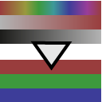

.. _net.sf.openfx.HSVToRGB:

HSVToRGB node
=============

.. raw:: html

   <!-- Do not edit this file! It is generated automatically by Natron itself. -->

|pluginIcon| 

*This documentation is for version 1.0 of HSVToRGB (net.sf.openfx.HSVToRGB).*

Description
-----------

Convert from HSV color model (hue, saturation, value, as defined by A. R. Smith in 1978) to linear RGB. H is in degrees, S and V are in the same units as RGB. No gamma correction is applied to RGB after conversion.

Inputs
------

+--------+-------------+----------+
| Input  | Description | Optional |
+========+=============+==========+
| Source |             | No       |
+--------+-------------+----------+

Controls
--------

.. tabularcolumns:: |>{\raggedright}p{0.2\columnwidth}|>{\raggedright}p{0.06\columnwidth}|>{\raggedright}p{0.07\columnwidth}|p{0.63\columnwidth}|

.. cssclass:: longtable

+-------------------------+---------+---------+---------------------------------------------------------------------------------------------------+
| Parameter / script name | Type    | Default | Function                                                                                          |
+=========================+=========+=========+===================================================================================================+
| Premult / ``premult``   | Boolean | Off     | Multiply the image by the alpha channel after processing. Use to get premultiplied output images. |
+-------------------------+---------+---------+---------------------------------------------------------------------------------------------------+

