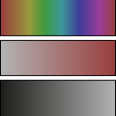

.. _net.sf.openfx.HSVToolPlugin:

HSVTool node
============

.. raw:: html

   <!-- Do not edit this file! It is generated automatically by Natron itself. -->

|pluginIcon| 

*This documentation is for version 1.0 of HSVTool (net.sf.openfx.HSVToolPlugin).*

Description
-----------

Adjust hue, saturation and brightness, or perform color replacement.

Color replacement:

Set the srcColor and dstColor parameters. The range of the replacement is determined by the three groups of parameters: Hue, Saturation and Brightness.

Color adjust:

Use the Rotation of the Hue parameter and the Adjustment of the Saturation and Lightness. The ranges and falloff parameters allow for more complex adjustments.

Hue keyer:

Set the outputAlpha parameter (the last one) to All (the default is Hue), and use a viewer to display the Alpha channel. First, set the Range parameter of the Hue parameter set and then work down the other Ranges parameters, tuning with the range Falloff and Adjustment parameters.

Inputs
------

+--------+-------------+----------+
| Input  | Description | Optional |
+========+=============+==========+
| Source |             | No       |
+--------+-------------+----------+
| Mask   |             | Yes      |
+--------+-------------+----------+

Controls
--------

.. tabularcolumns:: |>{\raggedright}p{0.2\columnwidth}|>{\raggedright}p{0.06\columnwidth}|>{\raggedright}p{0.07\columnwidth}|p{0.63\columnwidth}|

.. cssclass:: longtable

+-----------------------------------------------------------+---------+-----------------+----------------------------------------------------------------------------------------------------------------------------------------------------------------------------------------------------------------------------------------------------------------------------------------------------------------------+
| Parameter / script name                                   | Type    | Default         | Function                                                                                                                                                                                                                                                                                                             |
+===========================================================+=========+=================+======================================================================================================================================================================================================================================================================================================================+
| Src Analysis Rectangle / ``enableRectangle``              | Boolean | Off             | Enable the rectangle interact for analysis of Src and Dst colors and ranges.                                                                                                                                                                                                                                         |
+-----------------------------------------------------------+---------+-----------------+----------------------------------------------------------------------------------------------------------------------------------------------------------------------------------------------------------------------------------------------------------------------------------------------------------------------+
| Bottom Left / ``bottomLeft``                              | Double  | x: 0.25 y: 0.25 | Coordinates of the bottom left corner of the rectangle                                                                                                                                                                                                                                                               |
+-----------------------------------------------------------+---------+-----------------+----------------------------------------------------------------------------------------------------------------------------------------------------------------------------------------------------------------------------------------------------------------------------------------------------------------------+
| Size / ``size``                                           | Double  | w: 0.5 h: 0.5   | Width and height of the rectangle                                                                                                                                                                                                                                                                                    |
+-----------------------------------------------------------+---------+-----------------+----------------------------------------------------------------------------------------------------------------------------------------------------------------------------------------------------------------------------------------------------------------------------------------------------------------------+
| Set Src from Rectangle / ``setSrcFromRectangle``          | Button  |                 | Set the Src color and ranges and the adjustments from the colors of the source image within the selection rectangle and the Dst Color.                                                                                                                                                                               |
+-----------------------------------------------------------+---------+-----------------+----------------------------------------------------------------------------------------------------------------------------------------------------------------------------------------------------------------------------------------------------------------------------------------------------------------------+
| Src Color / ``srcColor``                                  | Color   | r: 0 g: 0 b: 0  | Source color for replacement. Changing this parameter sets the hue, saturation and brightness ranges for this color, and sets the fallofs to default values.                                                                                                                                                         |
+-----------------------------------------------------------+---------+-----------------+----------------------------------------------------------------------------------------------------------------------------------------------------------------------------------------------------------------------------------------------------------------------------------------------------------------------+
| Dst Color / ``dstColor``                                  | Color   | r: 0 g: 0 b: 0  | Destination color for replacement. Changing this parameter sets the hue rotation, and saturation and brightness adjustments. Should be set after Src Color.                                                                                                                                                          |
+-----------------------------------------------------------+---------+-----------------+----------------------------------------------------------------------------------------------------------------------------------------------------------------------------------------------------------------------------------------------------------------------------------------------------------------------+
| Hue Range / ``hueRange``                                  | Double  |  : 0  : 360     | Range of color hues that are modified (in degrees). Red is 0, green is 120, blue is 240. The affected hue range is the smallest interval. For example, if the range is (12, 348), then the selected range is red plus or minus 12 degrees. Exception: if the range width is exactly 360, then all hues are modified. |
+-----------------------------------------------------------+---------+-----------------+----------------------------------------------------------------------------------------------------------------------------------------------------------------------------------------------------------------------------------------------------------------------------------------------------------------------+
| Hue Rotation / ``hueRotation``                            | Double  | 0               | Rotation of color hues (in degrees) within the range.                                                                                                                                                                                                                                                                |
+-----------------------------------------------------------+---------+-----------------+----------------------------------------------------------------------------------------------------------------------------------------------------------------------------------------------------------------------------------------------------------------------------------------------------------------------+
| Hue Rotation Gain / ``hueRotationGain``                   | Double  | 1               | Factor to be applied to the rotation of color hues (in degrees) within the range. A value of 0 will set all values within range to a constant (computed at the center of the range), and a value of 1 will add hueRotation to all values within range.                                                               |
+-----------------------------------------------------------+---------+-----------------+----------------------------------------------------------------------------------------------------------------------------------------------------------------------------------------------------------------------------------------------------------------------------------------------------------------------+
| Hue Range Rolloff / ``hueRangeRolloff``                   | Double  | 0               | Interval (in degrees) around Hue Range, where hue rotation decreases progressively to zero.                                                                                                                                                                                                                          |
+-----------------------------------------------------------+---------+-----------------+----------------------------------------------------------------------------------------------------------------------------------------------------------------------------------------------------------------------------------------------------------------------------------------------------------------------+
| Saturation Range / ``saturationRange``                    | Double  |  : 0  : 1       | Range of color saturations that are modified.                                                                                                                                                                                                                                                                        |
+-----------------------------------------------------------+---------+-----------------+----------------------------------------------------------------------------------------------------------------------------------------------------------------------------------------------------------------------------------------------------------------------------------------------------------------------+
| Saturation Adjustment / ``saturationAdjustment``          | Double  | 0               | Adjustment of color saturations within the range. Saturation is clamped to zero to avoid color inversions.                                                                                                                                                                                                           |
+-----------------------------------------------------------+---------+-----------------+----------------------------------------------------------------------------------------------------------------------------------------------------------------------------------------------------------------------------------------------------------------------------------------------------------------------+
| Saturation Adjustment Gain / ``saturationAdjustmentGain`` | Double  | 1               | Factor to be applied to the saturation adjustment within the range. A value of 0 will set all values within range to a constant (computed at the center of the range), and a value of 1 will add saturationAdjustment to all values within range.                                                                    |
+-----------------------------------------------------------+---------+-----------------+----------------------------------------------------------------------------------------------------------------------------------------------------------------------------------------------------------------------------------------------------------------------------------------------------------------------+
| Saturation Range Rolloff / ``saturationRangeRolloff``     | Double  | 0               | Interval (in degrees) around Saturation Range, where saturation rotation decreases progressively to zero.                                                                                                                                                                                                            |
+-----------------------------------------------------------+---------+-----------------+----------------------------------------------------------------------------------------------------------------------------------------------------------------------------------------------------------------------------------------------------------------------------------------------------------------------+
| Brightness Range / ``brightnessRange``                    | Double  |  : 0  : 1       | Range of color brightness that are modified.                                                                                                                                                                                                                                                                         |
+-----------------------------------------------------------+---------+-----------------+----------------------------------------------------------------------------------------------------------------------------------------------------------------------------------------------------------------------------------------------------------------------------------------------------------------------+
| Brightness Adjustment / ``brightnessAdjustment``          | Double  | 0               | Adjustment of color brightness within the range.                                                                                                                                                                                                                                                                     |
+-----------------------------------------------------------+---------+-----------------+----------------------------------------------------------------------------------------------------------------------------------------------------------------------------------------------------------------------------------------------------------------------------------------------------------------------+
| Brightness Adjustment Gain / ``brightnessAdjustmentGain`` | Double  | 1               | Factor to be applied to the brightness adjustment within the range. A value of 0 will set all values within range to a constant (computed at the center of the range), and a value of 1 will add brightnessAdjustment to all values within range.                                                                    |
+-----------------------------------------------------------+---------+-----------------+----------------------------------------------------------------------------------------------------------------------------------------------------------------------------------------------------------------------------------------------------------------------------------------------------------------------+
| Brightness Range Rolloff / ``brightnessRangeRolloff``     | Double  | 0               | Interval (in degrees) around Brightness Range, where brightness rotation decreases progressively to zero.                                                                                                                                                                                                            |
+-----------------------------------------------------------+---------+-----------------+----------------------------------------------------------------------------------------------------------------------------------------------------------------------------------------------------------------------------------------------------------------------------------------------------------------------+
| Clamp Black / ``clampBlack``                              | Boolean | On              | All colors below 0 on output are set to 0.                                                                                                                                                                                                                                                                           |
+-----------------------------------------------------------+---------+-----------------+----------------------------------------------------------------------------------------------------------------------------------------------------------------------------------------------------------------------------------------------------------------------------------------------------------------------+
| Clamp White / ``clampWhite``                              | Boolean | Off             | All colors above 1 on output are set to 1.                                                                                                                                                                                                                                                                           |
+-----------------------------------------------------------+---------+-----------------+----------------------------------------------------------------------------------------------------------------------------------------------------------------------------------------------------------------------------------------------------------------------------------------------------------------------+
| Output Alpha / ``outputAlpha``                            | Choice  | Hue             | | Output alpha channel. This can either be the source alpha, one of the coefficients for hue, saturation, brightness, or a combination of those. If it is not source alpha, the image on output are unpremultiplied, even if input is premultiplied.                                                                 |
|                                                           |         |                 | | **Source (source)**: Alpha channel is kept unmodified.                                                                                                                                                                                                                                                             |
|                                                           |         |                 | | **Hue (hue)**: Set Alpha to the Hue modification mask.                                                                                                                                                                                                                                                             |
|                                                           |         |                 | | **Saturation (saturation)**: Set Alpha to the Saturation modification mask.                                                                                                                                                                                                                                        |
|                                                           |         |                 | | **Brightness (brightness)**: Alpha is set to the Brightness mask.                                                                                                                                                                                                                                                  |
|                                                           |         |                 | | **min(Hue,Saturation) (minhuesaturation)**: Alpha is set to min(Hue mask,Saturation mask)                                                                                                                                                                                                                          |
|                                                           |         |                 | | **min(Hue,Brightness) (minhuebrightness)**: Alpha is set to min(Hue mask,Brightness mask)                                                                                                                                                                                                                          |
|                                                           |         |                 | | **min(Saturation,Brightness) (minsaturationbrightness)**: Alpha is set to min(Saturation mask,Brightness mask)                                                                                                                                                                                                     |
|                                                           |         |                 | | **min(all) (min)**: Alpha is set to min(Hue mask,Saturation mask,Brightness mask)                                                                                                                                                                                                                                  |
+-----------------------------------------------------------+---------+-----------------+----------------------------------------------------------------------------------------------------------------------------------------------------------------------------------------------------------------------------------------------------------------------------------------------------------------------+
| (Un)premult / ``premult``                                 | Boolean | Off             | Divide the image by the alpha channel before processing, and re-multiply it afterwards. Use if the input images are premultiplied.                                                                                                                                                                                   |
+-----------------------------------------------------------+---------+-----------------+----------------------------------------------------------------------------------------------------------------------------------------------------------------------------------------------------------------------------------------------------------------------------------------------------------------------+
| Invert Mask / ``maskInvert``                              | Boolean | Off             | When checked, the effect is fully applied where the mask is 0.                                                                                                                                                                                                                                                       |
+-----------------------------------------------------------+---------+-----------------+----------------------------------------------------------------------------------------------------------------------------------------------------------------------------------------------------------------------------------------------------------------------------------------------------------------------+
| Mix / ``mix``                                             | Double  | 1               | Mix factor between the original and the transformed image.                                                                                                                                                                                                                                                           |
+-----------------------------------------------------------+---------+-----------------+----------------------------------------------------------------------------------------------------------------------------------------------------------------------------------------------------------------------------------------------------------------------------------------------------------------------+

