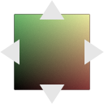

.. _net.sf.openfx.IDistort:

IDistort node
=============

|pluginIcon| 

*This documentation is for version 2.0 of IDistort.*

Description
-----------

Distort an image, based on a displacement map.

The U and V channels give the offset in pixels in the destination image to the pixel where the color is taken. For example, if at pixel (45,12) the UV value is (-1.5,3.2), then the color at this pixel is taken from (43.5,15.2) in the source image. This plugin concatenates transforms upstream, so that if the nodes upstream output a 3x3 transform (e.g. Transform, CornerPin, Dot, NoOp, Switch), the original image is sampled only once.

This plugin concatenates transforms upstream.

Inputs
------

+----------+---------------+------------+
| Input    | Description   | Optional   |
+==========+===============+============+
| Source   |               | No         |
+----------+---------------+------------+
| UV       |               | No         |
+----------+---------------+------------+
| Mask     |               | Yes        |
+----------+---------------+------------+

Controls
--------

.. tabularcolumns:: |>{\raggedright}p{0.2\columnwidth}|>{\raggedright}p{0.06\columnwidth}|>{\raggedright}p{0.07\columnwidth}|p{0.63\columnwidth}|

.. cssclass:: longtable

+--------------------------------------+-----------+-------------+----------------------------------------------------------------------------------------------------------------------------------------------------+
| Parameter / script name              | Type      | Default     | Function                                                                                                                                           |
+======================================+===========+=============+====================================================================================================================================================+
| U Channel / ``channelU``             | Choice    | UV.r        | | Input U channel from UV.                                                                                                                         |
|                                      |           |             | | **UV.r**: Red channel from input UV                                                                                                              |
|                                      |           |             | | **UV.g**: Green channel from input UV                                                                                                            |
|                                      |           |             | | **UV.b**: Blue channel from input UV                                                                                                             |
|                                      |           |             | | **UV.a**: Alpha channel from input UV                                                                                                            |
|                                      |           |             | | **0**: 0 constant channel                                                                                                                        |
|                                      |           |             | | **1**: 1 constant channel                                                                                                                        |
+--------------------------------------+-----------+-------------+----------------------------------------------------------------------------------------------------------------------------------------------------+
| V Channel / ``channelV``             | Choice    | UV.g        | | Input V channel from UV.                                                                                                                         |
|                                      |           |             | | **UV.r**: Red channel from input UV                                                                                                              |
|                                      |           |             | | **UV.g**: Green channel from input UV                                                                                                            |
|                                      |           |             | | **UV.b**: Blue channel from input UV                                                                                                             |
|                                      |           |             | | **UV.a**: Alpha channel from input UV                                                                                                            |
|                                      |           |             | | **0**: 0 constant channel                                                                                                                        |
|                                      |           |             | | **1**: 1 constant channel                                                                                                                        |
+--------------------------------------+-----------+-------------+----------------------------------------------------------------------------------------------------------------------------------------------------+
| Alpha Channel / ``channelA``         | Choice    | UV.a        | | Input Alpha channel from UV. The Output alpha is set to this value. If "Unpremult UV" is checked, the UV values are divided by alpha.            |
|                                      |           |             | | **UV.r**: Red channel from input UV                                                                                                              |
|                                      |           |             | | **UV.g**: Green channel from input UV                                                                                                            |
|                                      |           |             | | **UV.b**: Blue channel from input UV                                                                                                             |
|                                      |           |             | | **UV.a**: Alpha channel from input UV                                                                                                            |
|                                      |           |             | | **0**: 0 constant channel                                                                                                                        |
|                                      |           |             | | **1**: 1 constant channel                                                                                                                        |
+--------------------------------------+-----------+-------------+----------------------------------------------------------------------------------------------------------------------------------------------------+
| Unpremult UV / ``unpremultUV``       | Boolean   | Off         | Unpremult UV by Alpha from UV. Check if UV values look small for small values of Alpha (3D software sometimes write premultiplied UV values).      |
+--------------------------------------+-----------+-------------+----------------------------------------------------------------------------------------------------------------------------------------------------+
| UV Offset / ``uvOffset``             | Double    | U: 0 V: 0   | Offset to apply to the U and V channel (useful if these were stored in a file that cannot handle negative numbers)                                 |
+--------------------------------------+-----------+-------------+----------------------------------------------------------------------------------------------------------------------------------------------------+
| UV Scale / ``uvScale``               | Double    | U: 1 V: 1   | Scale factor to apply to the U and V channel (useful if these were stored in a file that can only store integer values)                            |
+--------------------------------------+-----------+-------------+----------------------------------------------------------------------------------------------------------------------------------------------------+
| Filter / ``filter``                  | Choice    | Cubic       | | Filtering algorithm - some filters may produce values outside of the initial range (\*) or modify the values even if there is no movement (+).   |
|                                      |           |             | | **Impulse**: (nearest neighbor / box) Use original values                                                                                        |
|                                      |           |             | | **Bilinear**: (tent / triangle) Bilinear interpolation between original values                                                                   |
|                                      |           |             | | **Cubic**: (cubic spline) Some smoothing                                                                                                         |
|                                      |           |             | | **Keys**: (Catmull-Rom / Hermite spline) Some smoothing, plus minor sharpening (\*)                                                              |
|                                      |           |             | | **Simon**: Some smoothing, plus medium sharpening (\*)                                                                                           |
|                                      |           |             | | **Rifman**: Some smoothing, plus significant sharpening (\*)                                                                                     |
|                                      |           |             | | **Mitchell**: Some smoothing, plus blurring to hide pixelation (\*+)                                                                             |
|                                      |           |             | | **Parzen**: (cubic B-spline) Greatest smoothing of all filters (+)                                                                               |
|                                      |           |             | | **Notch**: Flat smoothing (which tends to hide moire' patterns) (+)                                                                              |
+--------------------------------------+-----------+-------------+----------------------------------------------------------------------------------------------------------------------------------------------------+
| Clamp / ``clamp``                    | Boolean   | Off         | Clamp filter output within the original range - useful to avoid negative values in mattes                                                          |
+--------------------------------------+-----------+-------------+----------------------------------------------------------------------------------------------------------------------------------------------------+
| Black outside / ``black\_outside``   | Boolean   | Off         | Fill the area outside the source image with black                                                                                                  |
+--------------------------------------+-----------+-------------+----------------------------------------------------------------------------------------------------------------------------------------------------+
| (Un)premult / ``premult``            | Boolean   | Off         | Divide the image by the alpha channel before processing, and re-multiply it afterwards. Use if the input images are premultiplied.                 |
+--------------------------------------+-----------+-------------+----------------------------------------------------------------------------------------------------------------------------------------------------+
| Invert Mask / ``maskInvert``         | Boolean   | Off         | When checked, the effect is fully applied where the mask is 0.                                                                                     |
+--------------------------------------+-----------+-------------+----------------------------------------------------------------------------------------------------------------------------------------------------+
| Mix / ``mix``                        | Double    | 1           | Mix factor between the original and the transformed image.                                                                                         |
+--------------------------------------+-----------+-------------+----------------------------------------------------------------------------------------------------------------------------------------------------+

