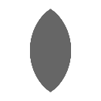

.. _net.sf.openfx.LensDistortion:

LensDistortion node
===================

.. raw:: html

   <!-- Do not edit this file! It is generated automatically by Natron itself. -->

|pluginIcon| 

*This documentation is for version 4.0 of LensDistortion (net.sf.openfx.LensDistortion).*

Description
-----------

Add or remove lens distortion, or produce an STMap that can be used to apply that transform.

The region of definition of the transformed image is computed from the region of definition of the Source input. If the input is defined outside of the project format, this may result in a very large region. A Crop effect may be inserted before LensDistortion to avoid this. If the input region of definition is inside the format, the Crop To Format parameter may be used to avoid expanding it.

LensDistortion can directly apply distortion/undistortion, but if the distortion parameters are not animated, the most efficient way to use LensDistortion and avoid repeated distortion function calculations is the following:

- If the footage size is not the same as the project size, insert a FrameHold plugin between the footage to distort or undistort and the Source input of LensDistortion. This connection is only used to get the size of the input footage.

- Set Output Mode to “STMap” in LensDistortion.

- feed the LensDistortion output into the UV input of STMap, and feed the footage into the Source input of STMap.

This plugin concatenates transforms upstream.

Inputs
------

+--------+-------------+----------+
| Input  | Description | Optional |
+========+=============+==========+
| Source |             | Yes      |
+--------+-------------+----------+
| Mask   |             | Yes      |
+--------+-------------+----------+

Controls
--------

.. tabularcolumns:: |>{\raggedright}p{0.2\columnwidth}|>{\raggedright}p{0.06\columnwidth}|>{\raggedright}p{0.07\columnwidth}|p{0.63\columnwidth}|

.. cssclass:: longtable

+----------------------------------------------------------------------+---------+---------------+--------------------------------------------------------------------------------------------------------------------------------------------------------------------------------------------------------------------------------------------------------------+
| Parameter / script name                                              | Type    | Default       | Function                                                                                                                                                                                                                                                     |
+======================================================================+=========+===============+==============================================================================================================================================================================================================================================================+
| Format / ``extent``                                                  | Choice  | Default       | | Reference format for lens distortion.                                                                                                                                                                                                                      |
|                                                                      |         |               | | **Format (format)**: Use a pre-defined image format.                                                                                                                                                                                                       |
|                                                                      |         |               | | **Size (size)**: Use a specific extent (size and offset).                                                                                                                                                                                                  |
|                                                                      |         |               | | **Project (project)**: Use the project extent (size and offset).                                                                                                                                                                                           |
|                                                                      |         |               | | **Default (default)**: Use the default extent (e.g. the source clip extent, if connected).                                                                                                                                                                 |
+----------------------------------------------------------------------+---------+---------------+--------------------------------------------------------------------------------------------------------------------------------------------------------------------------------------------------------------------------------------------------------------+
| Center / ``recenter``                                                | Button  |               | Centers the region of definition to the input region of definition. If there is no input, then the region of definition is centered to the project window.                                                                                                   |
+----------------------------------------------------------------------+---------+---------------+--------------------------------------------------------------------------------------------------------------------------------------------------------------------------------------------------------------------------------------------------------------+
| Format / ``NatronParamFormatChoice``                                 | Choice  | HD 1920x1080  | | The output format                                                                                                                                                                                                                                          |
|                                                                      |         |               | | **PC_Video 640x480 (PC_Video)**                                                                                                                                                                                                                            |
|                                                                      |         |               | | **NTSC 720x486 0.91 (NTSC)**                                                                                                                                                                                                                               |
|                                                                      |         |               | | **PAL 720x576 1.09 (PAL)**                                                                                                                                                                                                                                 |
|                                                                      |         |               | | **NTSC_16:9 720x486 1.21 (NTSC_16:9)**                                                                                                                                                                                                                     |
|                                                                      |         |               | | **PAL_16:9 720x576 1.46 (PAL_16:9)**                                                                                                                                                                                                                       |
|                                                                      |         |               | | **HD_720 1280x720 (HD_720)**                                                                                                                                                                                                                               |
|                                                                      |         |               | | **HD 1920x1080 (HD)**                                                                                                                                                                                                                                      |
|                                                                      |         |               | | **UHD_4K 3840x2160 (UHD_4K)**                                                                                                                                                                                                                              |
|                                                                      |         |               | | **1K_Super_35(full-ap) 1024x778 (1K_Super_35(full-ap))**                                                                                                                                                                                                   |
|                                                                      |         |               | | **1K_Cinemascope 914x778 2.00 (1K_Cinemascope)**                                                                                                                                                                                                           |
|                                                                      |         |               | | **2K_Super_35(full-ap) 2048x1556 (2K_Super_35(full-ap))**                                                                                                                                                                                                  |
|                                                                      |         |               | | **2K_Cinemascope 1828x1556 2.00 (2K_Cinemascope)**                                                                                                                                                                                                         |
|                                                                      |         |               | | **2K_DCP 2048x1080 (2K_DCP)**                                                                                                                                                                                                                              |
|                                                                      |         |               | | **4K_Super_35(full-ap) 4096x3112 (4K_Super_35(full-ap))**                                                                                                                                                                                                  |
|                                                                      |         |               | | **4K_Cinemascope 3656x3112 2.00 (4K_Cinemascope)**                                                                                                                                                                                                         |
|                                                                      |         |               | | **4K_DCP 4096x2160 (4K_DCP)**                                                                                                                                                                                                                              |
|                                                                      |         |               | | **square_256 256x256 (square_256)**                                                                                                                                                                                                                        |
|                                                                      |         |               | | **square_512 512x512 (square_512)**                                                                                                                                                                                                                        |
|                                                                      |         |               | | **square_1K 1024x1024 (square_1K)**                                                                                                                                                                                                                        |
|                                                                      |         |               | | **square_2K 2048x2048 (square_2K)**                                                                                                                                                                                                                        |
+----------------------------------------------------------------------+---------+---------------+--------------------------------------------------------------------------------------------------------------------------------------------------------------------------------------------------------------------------------------------------------------+
| Bottom Left / ``bottomLeft``                                         | Double  | x: 0 y: 0     | Coordinates of the bottom left corner of the size rectangle.                                                                                                                                                                                                 |
+----------------------------------------------------------------------+---------+---------------+--------------------------------------------------------------------------------------------------------------------------------------------------------------------------------------------------------------------------------------------------------------+
| Size / ``size``                                                      | Double  | w: 1 h: 1     | Width and height of the size rectangle.                                                                                                                                                                                                                      |
+----------------------------------------------------------------------+---------+---------------+--------------------------------------------------------------------------------------------------------------------------------------------------------------------------------------------------------------------------------------------------------------+
| Model / ``model``                                                    | Choice  | Nuke          | | Choice of the distortion model, i.e. the function that goes from distorted to undistorted image coordinates.                                                                                                                                               |
|                                                                      |         |               | | **Nuke (nuke)**: The model used in Nuke’s LensDistortion plugin.                                                                                                                                                                                           |
|                                                                      |         |               | | **PFBarrel (pfbarrel)**: The PFBarrel model used in PFTrack by PixelFarm.                                                                                                                                                                                  |
|                                                                      |         |               | | **3DE Classic (3declassic)**: Degree-2 anamorphic and degree-4 radial mixed model, used in 3DEqualizer by Science-D-Visions. Works, but it is recommended to use 3DE4 Radial Standard Degree 4 or 3DE4 Anamorphic Standard Degree 4 instead.               |
|                                                                      |         |               | | **3DE4 Anamorphic Degree 6 (3deanamorphic6)**: Degree-6 anamorphic model, used in 3DEqualizer by Science-D-Visions.                                                                                                                                        |
|                                                                      |         |               | | **3DE4 Radial Fisheye Degree 8 (3defisheye8)**: Radial lens distortion model with equisolid-angle fisheye projection, used in 3DEqualizer by Science-D-Visions.                                                                                            |
|                                                                      |         |               | | **3DE4 Radial Standard Degree 4 (3deradial4)**: Radial lens distortion model, a.k.a. radial decentered cylindric degree 4, which compensates for decentered lenses (and beam splitter artefacts in stereo rigs), used in 3DEqualizer by Science-D-Visions. |
|                                                                      |         |               | | **3DE4 Anamorphic Standard Degree 4 (3deanamorphic4)**: Degree-4 anamorphic model with anamorphic lens rotation, which handles ‘human-touched’ mounted anamorphic lenses, used in 3DEqualizer by Science-D-Visions.                                        |
|                                                                      |         |               | | **PanoTools (panotools)**: The model used in PanoTools, PTGui, PTAssembler, Hugin. See http://wiki.panotools.org/Lens_correction_model                                                                                                                     |
+----------------------------------------------------------------------+---------+---------------+--------------------------------------------------------------------------------------------------------------------------------------------------------------------------------------------------------------------------------------------------------------+
| Direction / ``direction``                                            | Choice  | Distort       | | Should the output correspond to applying or to removing distortion.                                                                                                                                                                                        |
|                                                                      |         |               | | **Distort**: The output corresponds to applying distortion.                                                                                                                                                                                                |
|                                                                      |         |               | | **Undistort**: The output corresponds to removing distortion.                                                                                                                                                                                              |
+----------------------------------------------------------------------+---------+---------------+--------------------------------------------------------------------------------------------------------------------------------------------------------------------------------------------------------------------------------------------------------------+
| Output Mode / ``outputMode``                                         | Choice  | Image         | | Choice of the output, which may be either a distorted/undistorted image, or a distortion/undistortion STMap.                                                                                                                                               |
|                                                                      |         |               | | **Image**: The output is the distorted/undistorted Source.                                                                                                                                                                                                 |
|                                                                      |         |               | | **STMap**: The output is a distortion/undistortion STMap. It is recommended to insert a FrameHold node at the Source input so that the STMap is computed only once if the parameters are not animated.                                                     |
+----------------------------------------------------------------------+---------+---------------+--------------------------------------------------------------------------------------------------------------------------------------------------------------------------------------------------------------------------------------------------------------+
| K1 / ``k1``                                                          | Double  | 0             | Nuke: First radial distortion coefficient (coefficient for r^2).                                                                                                                                                                                             |
+----------------------------------------------------------------------+---------+---------------+--------------------------------------------------------------------------------------------------------------------------------------------------------------------------------------------------------------------------------------------------------------+
| K2 / ``k2``                                                          | Double  | 0             | Nuke: Second radial distortion coefficient (coefficient for r^4).                                                                                                                                                                                            |
+----------------------------------------------------------------------+---------+---------------+--------------------------------------------------------------------------------------------------------------------------------------------------------------------------------------------------------------------------------------------------------------+
| Center / ``center``                                                  | Double  | x: 0 y: 0     | Nuke: Offset of the distortion center from the image center.                                                                                                                                                                                                 |
+----------------------------------------------------------------------+---------+---------------+--------------------------------------------------------------------------------------------------------------------------------------------------------------------------------------------------------------------------------------------------------------+
| Squeeze / ``anamorphicSqueeze``                                      | Double  | 1             | Nuke: Anamorphic squeeze (only for anamorphic lens).                                                                                                                                                                                                         |
+----------------------------------------------------------------------+---------+---------------+--------------------------------------------------------------------------------------------------------------------------------------------------------------------------------------------------------------------------------------------------------------+
| Asymmetric / ``asymmetricDistortion``                                | Double  | x: 0 y: 0     | Nuke: Asymmetric distortion (only for anamorphic lens).                                                                                                                                                                                                      |
+----------------------------------------------------------------------+---------+---------------+--------------------------------------------------------------------------------------------------------------------------------------------------------------------------------------------------------------------------------------------------------------+
| File / ``pfFile``                                                    | N/A     |               | The location of the PFBarrel .pfb file to use. Keyframes are set if present in the file.                                                                                                                                                                     |
+----------------------------------------------------------------------+---------+---------------+--------------------------------------------------------------------------------------------------------------------------------------------------------------------------------------------------------------------------------------------------------------+
| C3 / ``pfC3``                                                        | Double  | 0             | PFBarrel: Low order radial distortion coefficient.                                                                                                                                                                                                           |
+----------------------------------------------------------------------+---------+---------------+--------------------------------------------------------------------------------------------------------------------------------------------------------------------------------------------------------------------------------------------------------------+
| C5 / ``pfC5``                                                        | Double  | 0             | PFBarrel: Low order radial distortion coefficient.                                                                                                                                                                                                           |
+----------------------------------------------------------------------+---------+---------------+--------------------------------------------------------------------------------------------------------------------------------------------------------------------------------------------------------------------------------------------------------------+
| Center / ``pfP``                                                     | Double  | x: 0.5 y: 0.5 | PFBarrel: The distortion center of the lens (specified as a factor rather than a pixel value)                                                                                                                                                                |
+----------------------------------------------------------------------+---------+---------------+--------------------------------------------------------------------------------------------------------------------------------------------------------------------------------------------------------------------------------------------------------------+
| Squeeze / ``pfSqueeze``                                              | Double  | 1             | PFBarrel: Anamorphic squeeze (only for anamorphic lens).                                                                                                                                                                                                     |
+----------------------------------------------------------------------+---------+---------------+--------------------------------------------------------------------------------------------------------------------------------------------------------------------------------------------------------------------------------------------------------------+
| fov left [unit coord] / ``tde4_field_of_view_xa_unit``               | Double  | 0             | 3DE4: Field of view.                                                                                                                                                                                                                                         |
+----------------------------------------------------------------------+---------+---------------+--------------------------------------------------------------------------------------------------------------------------------------------------------------------------------------------------------------------------------------------------------------+
| fov bottom [unit coord] / ``tde4_field_of_view_ya_unit``             | Double  | 0             | 3DE4: Field of view.                                                                                                                                                                                                                                         |
+----------------------------------------------------------------------+---------+---------------+--------------------------------------------------------------------------------------------------------------------------------------------------------------------------------------------------------------------------------------------------------------+
| fov right [unit coord] / ``tde4_field_of_view_xb_unit``              | Double  | 1             | 3DE4: Field of view.                                                                                                                                                                                                                                         |
+----------------------------------------------------------------------+---------+---------------+--------------------------------------------------------------------------------------------------------------------------------------------------------------------------------------------------------------------------------------------------------------+
| fov top [unit coord] / ``tde4_field_of_view_yb_unit``                | Double  | 1             | 3DE4: Field of view.                                                                                                                                                                                                                                         |
+----------------------------------------------------------------------+---------+---------------+--------------------------------------------------------------------------------------------------------------------------------------------------------------------------------------------------------------------------------------------------------------+
| tde4 focal length [cm] / ``tde4_focal_length_cm``                    | Double  | 1             | 3DE4: Focal length.                                                                                                                                                                                                                                          |
+----------------------------------------------------------------------+---------+---------------+--------------------------------------------------------------------------------------------------------------------------------------------------------------------------------------------------------------------------------------------------------------+
| tde4 focus distance [cm] / ``tde4_custom_focus_distance_cm``         | Double  | 100           | 3DE4: Focus distance.                                                                                                                                                                                                                                        |
+----------------------------------------------------------------------+---------+---------------+--------------------------------------------------------------------------------------------------------------------------------------------------------------------------------------------------------------------------------------------------------------+
| tde4 filmback width [cm] / ``tde4_filmback_width_cm``                | Double  | 0.8           | 3DE4: Filmback width.                                                                                                                                                                                                                                        |
+----------------------------------------------------------------------+---------+---------------+--------------------------------------------------------------------------------------------------------------------------------------------------------------------------------------------------------------------------------------------------------------+
| tde4 filmback height [cm] / ``tde4_filmback_height_cm``              | Double  | 0.6           | 3DE4: Filmback height.                                                                                                                                                                                                                                       |
+----------------------------------------------------------------------+---------+---------------+--------------------------------------------------------------------------------------------------------------------------------------------------------------------------------------------------------------------------------------------------------------+
| tde4 lens center offset x [cm] / ``tde4_lens_center_offset_x_cm``    | Double  | 0             | 3DE4: Lens center horizontal offset.                                                                                                                                                                                                                         |
+----------------------------------------------------------------------+---------+---------------+--------------------------------------------------------------------------------------------------------------------------------------------------------------------------------------------------------------------------------------------------------------+
| tde4 lens center offset y [cm] / ``tde4_lens_center_offset_y_cm``    | Double  | 0             | 3DE4: Lens center vertical offset.                                                                                                                                                                                                                           |
+----------------------------------------------------------------------+---------+---------------+--------------------------------------------------------------------------------------------------------------------------------------------------------------------------------------------------------------------------------------------------------------+
| tde4 pixel aspect / ``tde4_pixel_aspect``                            | Double  | 1             | 3DE4: Pixel aspect ratio.                                                                                                                                                                                                                                    |
+----------------------------------------------------------------------+---------+---------------+--------------------------------------------------------------------------------------------------------------------------------------------------------------------------------------------------------------------------------------------------------------+
| Distortion / ``tde4_Distortion``                                     | Double  | 0             | 3DE Classic: Distortion.                                                                                                                                                                                                                                     |
+----------------------------------------------------------------------+---------+---------------+--------------------------------------------------------------------------------------------------------------------------------------------------------------------------------------------------------------------------------------------------------------+
| Anamorphic Squeeze / ``tde4_Anamorphic_Squeeze``                     | Double  | 1             | 3DE Classic: Anamorphic Squeeze.                                                                                                                                                                                                                             |
+----------------------------------------------------------------------+---------+---------------+--------------------------------------------------------------------------------------------------------------------------------------------------------------------------------------------------------------------------------------------------------------+
| Curvature X / ``tde4_Curvature_X``                                   | Double  | 0             | 3DE Classic: Curvature X.                                                                                                                                                                                                                                    |
+----------------------------------------------------------------------+---------+---------------+--------------------------------------------------------------------------------------------------------------------------------------------------------------------------------------------------------------------------------------------------------------+
| Curvature Y / ``tde4_Curvature_Y``                                   | Double  | 0             | 3DE Classic: Curvature Y.                                                                                                                                                                                                                                    |
+----------------------------------------------------------------------+---------+---------------+--------------------------------------------------------------------------------------------------------------------------------------------------------------------------------------------------------------------------------------------------------------+
| Quartic Distortion / ``tde4_Quartic_Distortion``                     | Double  | 0             | 3DE Classic: Quartic Distortion.                                                                                                                                                                                                                             |
+----------------------------------------------------------------------+---------+---------------+--------------------------------------------------------------------------------------------------------------------------------------------------------------------------------------------------------------------------------------------------------------+
| Distortion - Degree 2 / ``tde4_Distortion_Degree_2``                 | Double  | 0             | 3DE Standard and Fisheye: Distortion.                                                                                                                                                                                                                        |
+----------------------------------------------------------------------+---------+---------------+--------------------------------------------------------------------------------------------------------------------------------------------------------------------------------------------------------------------------------------------------------------+
| U - Degree 2 / ``tde4_U_Degree_2``                                   | Double  | 0             | 3DE Standard: U - Degree 2.                                                                                                                                                                                                                                  |
+----------------------------------------------------------------------+---------+---------------+--------------------------------------------------------------------------------------------------------------------------------------------------------------------------------------------------------------------------------------------------------------+
| V - Degree 2 / ``tde4_V_Degree_2``                                   | Double  | 0             | 3DE Standard: V - Degree 2.                                                                                                                                                                                                                                  |
+----------------------------------------------------------------------+---------+---------------+--------------------------------------------------------------------------------------------------------------------------------------------------------------------------------------------------------------------------------------------------------------+
| Quartic Distortion - Degree 4 / ``tde4_Quartic_Distortion_Degree_4`` | Double  | 0             | 3DE Standard and Fisheye: Quartic Distortion - Degree 4.                                                                                                                                                                                                     |
+----------------------------------------------------------------------+---------+---------------+--------------------------------------------------------------------------------------------------------------------------------------------------------------------------------------------------------------------------------------------------------------+
| U - Degree 4 / ``tde4_U_Degree_4``                                   | Double  | 0             | 3DE Standard: U - Degree 4.                                                                                                                                                                                                                                  |
+----------------------------------------------------------------------+---------+---------------+--------------------------------------------------------------------------------------------------------------------------------------------------------------------------------------------------------------------------------------------------------------+
| V - Degree 4 / ``tde4_V_Degree_4``                                   | Double  | 0             | 3DE Standard: V - Degree 4.                                                                                                                                                                                                                                  |
+----------------------------------------------------------------------+---------+---------------+--------------------------------------------------------------------------------------------------------------------------------------------------------------------------------------------------------------------------------------------------------------+
| Phi - Cylindric Direction / ``tde4_Phi_Cylindric_Direction``         | Double  | 0             | 3DE Standard: Phi - Cylindric Direction.                                                                                                                                                                                                                     |
+----------------------------------------------------------------------+---------+---------------+--------------------------------------------------------------------------------------------------------------------------------------------------------------------------------------------------------------------------------------------------------------+
| B - Cylindric Bending / ``tde4_B_Cylindric_Bending``                 | Double  | 0             | 3DE Standard: B - Cylindric Bending.                                                                                                                                                                                                                         |
+----------------------------------------------------------------------+---------+---------------+--------------------------------------------------------------------------------------------------------------------------------------------------------------------------------------------------------------------------------------------------------------+
| Cx02 - Degree 2 / ``tde4_Cx02_Degree_2``                             | Double  | 0             | 3DE Anamorphic 4 and 6: Cx02 - Degree 2.                                                                                                                                                                                                                     |
+----------------------------------------------------------------------+---------+---------------+--------------------------------------------------------------------------------------------------------------------------------------------------------------------------------------------------------------------------------------------------------------+
| Cy02 - Degree 2 / ``tde4_Cy02_Degree_2``                             | Double  | 0             | 3DE Anamorphic 4 and 6: Cy02 - Degree 2.                                                                                                                                                                                                                     |
+----------------------------------------------------------------------+---------+---------------+--------------------------------------------------------------------------------------------------------------------------------------------------------------------------------------------------------------------------------------------------------------+
| Cx22 - Degree 2 / ``tde4_Cx22_Degree_2``                             | Double  | 0             | 3DE Anamorphic 4 and 6: Cx22 - Degree 2.                                                                                                                                                                                                                     |
+----------------------------------------------------------------------+---------+---------------+--------------------------------------------------------------------------------------------------------------------------------------------------------------------------------------------------------------------------------------------------------------+
| Cy22 - Degree 2 / ``tde4_Cy22_Degree_2``                             | Double  | 0             | 3DE Anamorphic 4 and 6: Cy22 - Degree 2.                                                                                                                                                                                                                     |
+----------------------------------------------------------------------+---------+---------------+--------------------------------------------------------------------------------------------------------------------------------------------------------------------------------------------------------------------------------------------------------------+
| Cx04 - Degree 4 / ``tde4_Cx04_Degree_4``                             | Double  | 0             | 3DE Anamorphic 4 and 6: Cx04 - Degree 4.                                                                                                                                                                                                                     |
+----------------------------------------------------------------------+---------+---------------+--------------------------------------------------------------------------------------------------------------------------------------------------------------------------------------------------------------------------------------------------------------+
| Cy04 - Degree 4 / ``tde4_Cy04_Degree_4``                             | Double  | 0             | 3DE Anamorphic 4 and 6: Cy04 - Degree 4.                                                                                                                                                                                                                     |
+----------------------------------------------------------------------+---------+---------------+--------------------------------------------------------------------------------------------------------------------------------------------------------------------------------------------------------------------------------------------------------------+
| Cx24 - Degree 4 / ``tde4_Cx24_Degree_4``                             | Double  | 0             | 3DE Anamorphic 4 and 6: Cx24 - Degree 4.                                                                                                                                                                                                                     |
+----------------------------------------------------------------------+---------+---------------+--------------------------------------------------------------------------------------------------------------------------------------------------------------------------------------------------------------------------------------------------------------+
| Cy24 - Degree 4 / ``tde4_Cy24_Degree_4``                             | Double  | 0             | 3DE Anamorphic 4 and 6: Cy24 - Degree 4.                                                                                                                                                                                                                     |
+----------------------------------------------------------------------+---------+---------------+--------------------------------------------------------------------------------------------------------------------------------------------------------------------------------------------------------------------------------------------------------------+
| Cx44 - Degree 4 / ``tde4_Cx44_Degree_4``                             | Double  | 0             | 3DE Anamorphic 4 and 6: Cx44 - Degree 4.                                                                                                                                                                                                                     |
+----------------------------------------------------------------------+---------+---------------+--------------------------------------------------------------------------------------------------------------------------------------------------------------------------------------------------------------------------------------------------------------+
| Cy44 - Degree 4 / ``tde4_Cy44_Degree_4``                             | Double  | 0             | 3DE Anamorphic 4 and 6: Cy44 - Degree 4.                                                                                                                                                                                                                     |
+----------------------------------------------------------------------+---------+---------------+--------------------------------------------------------------------------------------------------------------------------------------------------------------------------------------------------------------------------------------------------------------+
| Cx06 - Degree 6 / ``tde4_Cx06_Degree_6``                             | Double  | 0             | 3DE Anamorphic 6: Cx06 - Degree 6.                                                                                                                                                                                                                           |
+----------------------------------------------------------------------+---------+---------------+--------------------------------------------------------------------------------------------------------------------------------------------------------------------------------------------------------------------------------------------------------------+
| Cy06 - Degree 6 / ``tde4_Cy06_Degree_6``                             | Double  | 0             | 3DE Anamorphic 6: Cy06 - Degree 6.                                                                                                                                                                                                                           |
+----------------------------------------------------------------------+---------+---------------+--------------------------------------------------------------------------------------------------------------------------------------------------------------------------------------------------------------------------------------------------------------+
| Cx26 - Degree 6 / ``tde4_Cx26_Degree_6``                             | Double  | 0             | 3DE Anamorphic 6: Cx26 - Degree 6.                                                                                                                                                                                                                           |
+----------------------------------------------------------------------+---------+---------------+--------------------------------------------------------------------------------------------------------------------------------------------------------------------------------------------------------------------------------------------------------------+
| Cy26 - Degree 6 / ``tde4_Cy26_Degree_6``                             | Double  | 0             | 3DE Anamorphic 6: Cy26 - Degree 6.                                                                                                                                                                                                                           |
+----------------------------------------------------------------------+---------+---------------+--------------------------------------------------------------------------------------------------------------------------------------------------------------------------------------------------------------------------------------------------------------+
| Cx46 - Degree 6 / ``tde4_Cx46_Degree_6``                             | Double  | 0             | 3DE Anamorphic 6: Cx46 - Degree 6.                                                                                                                                                                                                                           |
+----------------------------------------------------------------------+---------+---------------+--------------------------------------------------------------------------------------------------------------------------------------------------------------------------------------------------------------------------------------------------------------+
| Cy46 - Degree 6 / ``tde4_Cy46_Degree_6``                             | Double  | 0             | 3DE Anamorphic 6: Cy46 - Degree 6.                                                                                                                                                                                                                           |
+----------------------------------------------------------------------+---------+---------------+--------------------------------------------------------------------------------------------------------------------------------------------------------------------------------------------------------------------------------------------------------------+
| Cx66 - Degree 6 / ``tde4_Cx66_Degree_6``                             | Double  | 0             | 3DE Anamorphic 6: Cx66 - Degree 6.                                                                                                                                                                                                                           |
+----------------------------------------------------------------------+---------+---------------+--------------------------------------------------------------------------------------------------------------------------------------------------------------------------------------------------------------------------------------------------------------+
| Cy66 - Degree 6 / ``tde4_Cy66_Degree_6``                             | Double  | 0             | 3DE Anamorphic 6: Cy66 - Degree 6.                                                                                                                                                                                                                           |
+----------------------------------------------------------------------+---------+---------------+--------------------------------------------------------------------------------------------------------------------------------------------------------------------------------------------------------------------------------------------------------------+
| Lens Rotation 4 / ``tde4_Lens_Rotation``                             | Double  | 0             | 3DE Anamorphic 4: Lens Rotation 4.                                                                                                                                                                                                                           |
+----------------------------------------------------------------------+---------+---------------+--------------------------------------------------------------------------------------------------------------------------------------------------------------------------------------------------------------------------------------------------------------+
| Squeeze-X / ``tde4_Squeeze_X``                                       | Double  | 1             | 3DE Anamorphic 4: Squeeze-X.                                                                                                                                                                                                                                 |
+----------------------------------------------------------------------+---------+---------------+--------------------------------------------------------------------------------------------------------------------------------------------------------------------------------------------------------------------------------------------------------------+
| Squeeze-Y / ``tde4_Squeeze_Y``                                       | Double  | 1             | 3DE Anamorphic 4: Squeeze-Y.                                                                                                                                                                                                                                 |
+----------------------------------------------------------------------+---------+---------------+--------------------------------------------------------------------------------------------------------------------------------------------------------------------------------------------------------------------------------------------------------------+
| Degree 6 / ``tde4_Degree_6``                                         | Double  | 0             | 3DE Fisheye: Degree 6.                                                                                                                                                                                                                                       |
+----------------------------------------------------------------------+---------+---------------+--------------------------------------------------------------------------------------------------------------------------------------------------------------------------------------------------------------------------------------------------------------+
| Degree 8 / ``tde4_Degree_8``                                         | Double  | 0             | 3DE Fisheye: Degree 8.                                                                                                                                                                                                                                       |
+----------------------------------------------------------------------+---------+---------------+--------------------------------------------------------------------------------------------------------------------------------------------------------------------------------------------------------------------------------------------------------------+
| a / ``pt_a``                                                         | Double  | 0             | PanoTools: Radial lens distortion 3rd degree coefficient a.                                                                                                                                                                                                  |
+----------------------------------------------------------------------+---------+---------------+--------------------------------------------------------------------------------------------------------------------------------------------------------------------------------------------------------------------------------------------------------------+
| b / ``pt_b``                                                         | Double  | 0             | PanoTools: Radial lens distortion 2nd degree coefficient b.                                                                                                                                                                                                  |
+----------------------------------------------------------------------+---------+---------------+--------------------------------------------------------------------------------------------------------------------------------------------------------------------------------------------------------------------------------------------------------------+
| c / ``pt_c``                                                         | Double  | 0             | PanoTools: Radial lens distortion 1st degree coefficient c.                                                                                                                                                                                                  |
+----------------------------------------------------------------------+---------+---------------+--------------------------------------------------------------------------------------------------------------------------------------------------------------------------------------------------------------------------------------------------------------+
| d / ``pt_d``                                                         | Double  | 0             | PanoTools: Horizontal lens shift (in pixels).                                                                                                                                                                                                                |
+----------------------------------------------------------------------+---------+---------------+--------------------------------------------------------------------------------------------------------------------------------------------------------------------------------------------------------------------------------------------------------------+
| e / ``pt_e``                                                         | Double  | 0             | PanoTools: Vertical lens shift (in pixels).                                                                                                                                                                                                                  |
+----------------------------------------------------------------------+---------+---------------+--------------------------------------------------------------------------------------------------------------------------------------------------------------------------------------------------------------------------------------------------------------+
| g / ``pt_g``                                                         | Double  | 0             | PanoTools: Vertical lens shear (in pixels). Use to remove slight misalignment of the line scanner relative to the film transport.                                                                                                                            |
+----------------------------------------------------------------------+---------+---------------+--------------------------------------------------------------------------------------------------------------------------------------------------------------------------------------------------------------------------------------------------------------+
| t / ``pt_t``                                                         | Double  | 0             | PanoTools: Horizontal lens shear (in pixels).                                                                                                                                                                                                                |
+----------------------------------------------------------------------+---------+---------------+--------------------------------------------------------------------------------------------------------------------------------------------------------------------------------------------------------------------------------------------------------------+
| Filter / ``filter``                                                  | Choice  | Cubic         | | Filtering algorithm - some filters may produce values outside of the initial range (*) or modify the values even if there is no movement (+).                                                                                                              |
|                                                                      |         |               | | **Impulse (impulse)**: (nearest neighbor / box) Use original values.                                                                                                                                                                                       |
|                                                                      |         |               | | **Box (box)**: Integrate the source image over the bounding box of the back-transformed pixel.                                                                                                                                                             |
|                                                                      |         |               | | **Bilinear (bilinear)**: (tent / triangle) Bilinear interpolation between original values.                                                                                                                                                                 |
|                                                                      |         |               | | **Cubic (cubic)**: (cubic spline) Some smoothing.                                                                                                                                                                                                          |
|                                                                      |         |               | | **Keys (keys)**: (Catmull-Rom / Hermite spline) Some smoothing, plus minor sharpening (*).                                                                                                                                                                 |
|                                                                      |         |               | | **Simon (simon)**: Some smoothing, plus medium sharpening (*).                                                                                                                                                                                             |
|                                                                      |         |               | | **Rifman (rifman)**: Some smoothing, plus significant sharpening (*).                                                                                                                                                                                      |
|                                                                      |         |               | | **Mitchell (mitchell)**: Some smoothing, plus blurring to hide pixelation (*)(+).                                                                                                                                                                          |
|                                                                      |         |               | | **Parzen (parzen)**: (cubic B-spline) Greatest smoothing of all filters (+).                                                                                                                                                                               |
|                                                                      |         |               | | **Notch (notch)**: Flat smoothing (which tends to hide moire’ patterns) (+).                                                                                                                                                                               |
+----------------------------------------------------------------------+---------+---------------+--------------------------------------------------------------------------------------------------------------------------------------------------------------------------------------------------------------------------------------------------------------+
| Clamp / ``clamp``                                                    | Boolean | Off           | Clamp filter output within the original range - useful to avoid negative values in mattes                                                                                                                                                                    |
+----------------------------------------------------------------------+---------+---------------+--------------------------------------------------------------------------------------------------------------------------------------------------------------------------------------------------------------------------------------------------------------+
| Black outside / ``black_outside``                                    | Boolean | Off           | Fill the area outside the source image with black                                                                                                                                                                                                            |
+----------------------------------------------------------------------+---------+---------------+--------------------------------------------------------------------------------------------------------------------------------------------------------------------------------------------------------------------------------------------------------------+
| Crop To Format / ``cropToFormat``                                    | Boolean | On            | If the source is inside the format and the effect extends it outside of the format, crop it to avoid unnecessary calculations. To avoid unwanted crops, only the borders that were inside of the format in the source clip will be cropped.                  |
+----------------------------------------------------------------------+---------+---------------+--------------------------------------------------------------------------------------------------------------------------------------------------------------------------------------------------------------------------------------------------------------+
| Use Source RoD / ``useRoD``                                          | Boolean | Off           | Use the region of definition of the source as the source format.                                                                                                                                                                                             |
+----------------------------------------------------------------------+---------+---------------+--------------------------------------------------------------------------------------------------------------------------------------------------------------------------------------------------------------------------------------------------------------+
| (Un)premult / ``premult``                                            | Boolean | Off           | Divide the image by the alpha channel before processing, and re-multiply it afterwards. Use if the input images are premultiplied.                                                                                                                           |
+----------------------------------------------------------------------+---------+---------------+--------------------------------------------------------------------------------------------------------------------------------------------------------------------------------------------------------------------------------------------------------------+
| Invert Mask / ``maskInvert``                                         | Boolean | Off           | When checked, the effect is fully applied where the mask is 0.                                                                                                                                                                                               |
+----------------------------------------------------------------------+---------+---------------+--------------------------------------------------------------------------------------------------------------------------------------------------------------------------------------------------------------------------------------------------------------+
| Mix / ``mix``                                                        | Double  | 1             | Mix factor between the original and the transformed image.                                                                                                                                                                                                   |
+----------------------------------------------------------------------+---------+---------------+--------------------------------------------------------------------------------------------------------------------------------------------------------------------------------------------------------------------------------------------------------------+

