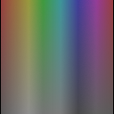

.. _net.sf.openfx.SaturationPlugin:

Saturation node
===============

.. raw:: html

   <!-- Do not edit this file! It is generated automatically by Natron itself. -->

|pluginIcon| 

*This documentation is for version 2.0 of Saturation (net.sf.openfx.SaturationPlugin).*

Description
-----------

Modify the color saturation of an image.

See also: http://opticalenquiry.com/nuke/index.php?title=Saturation

Inputs
------

+--------+-------------+----------+
| Input  | Description | Optional |
+========+=============+==========+
| Source |             | No       |
+--------+-------------+----------+
| Mask   |             | Yes      |
+--------+-------------+----------+

Controls
--------

.. tabularcolumns:: |>{\raggedright}p{0.2\columnwidth}|>{\raggedright}p{0.06\columnwidth}|>{\raggedright}p{0.07\columnwidth}|p{0.63\columnwidth}|

.. cssclass:: longtable

+------------------------------------+---------+----------+------------------------------------------------------------------------------------------------------------------------------------+
| Parameter / script name            | Type    | Default  | Function                                                                                                                           |
+====================================+=========+==========+====================================================================================================================================+
| Saturation / ``saturation``        | Double  | 1        | Color saturation factor to apply. 0 produces grayscale.                                                                            |
+------------------------------------+---------+----------+------------------------------------------------------------------------------------------------------------------------------------+
| Luminance Math / ``luminanceMath`` | Choice  | Rec. 709 | | Formula used to compute luminance from RGB values.                                                                               |
|                                    |         |          | | **Rec. 709 (rec709)**: Use Rec. 709 (0.2126r + 0.7152g + 0.0722b).                                                               |
|                                    |         |          | | **Rec. 2020 (rec2020)**: Use Rec. 2020 (0.2627r + 0.6780g + 0.0593b).                                                            |
|                                    |         |          | | **ACES AP0 (acesap0)**: Use ACES AP0 (0.3439664498r + 0.7281660966g + -0.0721325464b).                                           |
|                                    |         |          | | **ACES AP1 (acesap1)**: Use ACES AP1 (0.2722287168r + 0.6740817658g + 0.0536895174b).                                            |
|                                    |         |          | | **CCIR 601 (ccir601)**: Use CCIR 601 (0.2989r + 0.5866g + 0.1145b).                                                              |
|                                    |         |          | | **Average (average)**: Use average of r, g, b.                                                                                   |
|                                    |         |          | | **Max (max)**: Use max or r, g, b.                                                                                               |
+------------------------------------+---------+----------+------------------------------------------------------------------------------------------------------------------------------------+
| Clamp Black / ``clampBlack``       | Boolean | On       | All colors below 0 on output are set to 0.                                                                                         |
+------------------------------------+---------+----------+------------------------------------------------------------------------------------------------------------------------------------+
| Clamp White / ``clampWhite``       | Boolean | Off      | All colors above 1 on output are set to 1.                                                                                         |
+------------------------------------+---------+----------+------------------------------------------------------------------------------------------------------------------------------------+
| (Un)premult / ``premult``          | Boolean | Off      | Divide the image by the alpha channel before processing, and re-multiply it afterwards. Use if the input images are premultiplied. |
+------------------------------------+---------+----------+------------------------------------------------------------------------------------------------------------------------------------+
| Invert Mask / ``maskInvert``       | Boolean | Off      | When checked, the effect is fully applied where the mask is 0.                                                                     |
+------------------------------------+---------+----------+------------------------------------------------------------------------------------------------------------------------------------+
| Mix / ``mix``                      | Double  | 1        | Mix factor between the original and the transformed image.                                                                         |
+------------------------------------+---------+----------+------------------------------------------------------------------------------------------------------------------------------------+

