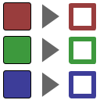

.. _net.sf.openfx.ShufflePlugin:

Shuffle node
============

.. raw:: html

   <!-- Do not edit this file! It is generated automatically by Natron itself. -->

|pluginIcon| 

*This documentation is for version 3.0 of Shuffle (net.sf.openfx.ShufflePlugin).*

Description
-----------

Rearrange channels from one or two inputs and/or convert to different bit depth or components. No colorspace conversion is done (mapping is linear, even for 8-bit and 16-bit types).

Inputs
------

+-------+-------------+----------+
| Input | Description | Optional |
+=======+=============+==========+
| B     |             | Yes      |
+-------+-------------+----------+
| A     |             | Yes      |
+-------+-------------+----------+

Controls
--------

.. tabularcolumns:: |>{\raggedright}p{0.2\columnwidth}|>{\raggedright}p{0.06\columnwidth}|>{\raggedright}p{0.07\columnwidth}|p{0.63\columnwidth}|

.. cssclass:: longtable

+------------------------------------------+---------+-----------------+--------------------------------------------------------------------------------------------------------------------------------------------------------------------------------------------------------------------------------------------------------------------------------------------------------------------------------------------------------------------------------------------------------------------------------------------------------------------------------------+
| Parameter / script name                  | Type    | Default         | Function                                                                                                                                                                                                                                                                                                                                                                                                                                                                             |
+==========================================+=========+=================+======================================================================================================================================================================================================================================================================================================================================================================================================================================================================================+
| Output Layer / ``outputLayer``           | Choice  | Color.RGBA      | | The layer where the result of the Shuffle operation is output.                                                                                                                                                                                                                                                                                                                                                                                                                     |
|                                          |         |                 | | **Color.RGBA (uk.co.thefoundry.OfxImagePlaneColour)**                                                                                                                                                                                                                                                                                                                                                                                                                              |
|                                          |         |                 | | **DisparityLeft.Disparity (uk.co.thefoundry.OfxImagePlaneStereoDisparityLeft)**                                                                                                                                                                                                                                                                                                                                                                                                    |
|                                          |         |                 | | **DisparityRight.Disparity (uk.co.thefoundry.OfxImagePlaneStereoDisparityRight)**                                                                                                                                                                                                                                                                                                                                                                                                  |
|                                          |         |                 | | **Backward.Motion (uk.co.thefoundry.OfxImagePlaneBackMotionVector)**                                                                                                                                                                                                                                                                                                                                                                                                               |
|                                          |         |                 | | **Forward.Motion (uk.co.thefoundry.OfxImagePlaneForwardMotionVector)**                                                                                                                                                                                                                                                                                                                                                                                                             |
+------------------------------------------+---------+-----------------+--------------------------------------------------------------------------------------------------------------------------------------------------------------------------------------------------------------------------------------------------------------------------------------------------------------------------------------------------------------------------------------------------------------------------------------------------------------------------------------+
| Output Components / ``outputComponents`` | Choice  | RGBA            | | Select what types of components the plug-in should output, this has an effect only when the Output Layer is set to the Color layer. This controls what should be the components for the Color Layer: Alpha, RGB or RGBA.                                                                                                                                                                                                                                                           |
|                                          |         |                 | | **RGBA (rgba)**: Output RGBA components.                                                                                                                                                                                                                                                                                                                                                                                                                                           |
|                                          |         |                 | | **RGB (rgb)**: Output RGB components.                                                                                                                                                                                                                                                                                                                                                                                                                                              |
|                                          |         |                 | | **Alpha (alpha)**: Output alpha channel.                                                                                                                                                                                                                                                                                                                                                                                                                                           |
+------------------------------------------+---------+-----------------+--------------------------------------------------------------------------------------------------------------------------------------------------------------------------------------------------------------------------------------------------------------------------------------------------------------------------------------------------------------------------------------------------------------------------------------------------------------------------------------+
| Output Premult / ``outputPremult``       | Choice  | Unpremultiplied | | Set the premultiplication metadata on the output. This does not modify the data itself. The premultiplication metadata will flow downstream so that further down effects know what kind of data to expect. By default it should be set to Unpremultiplied and you should always provide the Shuffle node unpremultiplied data. Providing alpha-premultiplied data in input of the Shuffle may produce wrong results because of the potential loss of the associated alpha channel. |
|                                          |         |                 | | **Opaque**                                                                                                                                                                                                                                                                                                                                                                                                                                                                         |
|                                          |         |                 | | **Premultiplied**                                                                                                                                                                                                                                                                                                                                                                                                                                                                  |
|                                          |         |                 | | **Unpremultiplied**                                                                                                                                                                                                                                                                                                                                                                                                                                                                |
+------------------------------------------+---------+-----------------+--------------------------------------------------------------------------------------------------------------------------------------------------------------------------------------------------------------------------------------------------------------------------------------------------------------------------------------------------------------------------------------------------------------------------------------------------------------------------------------+
| R / ``outputR``                          | Choice  | B.Color.R       | | Input channel for the output red channel.                                                                                                                                                                                                                                                                                                                                                                                                                                          |
|                                          |         |                 | | **A.Color.R (A.uk.co.thefoundry.OfxImagePlaneColour.R)**: R channel from input A                                                                                                                                                                                                                                                                                                                                                                                                   |
|                                          |         |                 | | **A.Color.G (A.uk.co.thefoundry.OfxImagePlaneColour.G)**: G channel from input A                                                                                                                                                                                                                                                                                                                                                                                                   |
|                                          |         |                 | | **A.Color.B (A.uk.co.thefoundry.OfxImagePlaneColour.B)**: B channel from input A                                                                                                                                                                                                                                                                                                                                                                                                   |
|                                          |         |                 | | **A.Color.A (A.uk.co.thefoundry.OfxImagePlaneColour.A)**: A channel from input A                                                                                                                                                                                                                                                                                                                                                                                                   |
|                                          |         |                 | | **0**: 0 constant channel                                                                                                                                                                                                                                                                                                                                                                                                                                                          |
|                                          |         |                 | | **1**: 1 constant channel                                                                                                                                                                                                                                                                                                                                                                                                                                                          |
|                                          |         |                 | | **B.Color.R (B.uk.co.thefoundry.OfxImagePlaneColour.R)**: R channel from input B                                                                                                                                                                                                                                                                                                                                                                                                   |
|                                          |         |                 | | **B.Color.G (B.uk.co.thefoundry.OfxImagePlaneColour.G)**: G channel from input B                                                                                                                                                                                                                                                                                                                                                                                                   |
|                                          |         |                 | | **B.Color.B (B.uk.co.thefoundry.OfxImagePlaneColour.B)**: B channel from input B                                                                                                                                                                                                                                                                                                                                                                                                   |
|                                          |         |                 | | **B.Color.A (B.uk.co.thefoundry.OfxImagePlaneColour.A)**: A channel from input B                                                                                                                                                                                                                                                                                                                                                                                                   |
+------------------------------------------+---------+-----------------+--------------------------------------------------------------------------------------------------------------------------------------------------------------------------------------------------------------------------------------------------------------------------------------------------------------------------------------------------------------------------------------------------------------------------------------------------------------------------------------+
| G / ``outputG``                          | Choice  | B.Color.G       | | Input channel for the output green channel.                                                                                                                                                                                                                                                                                                                                                                                                                                        |
|                                          |         |                 | | **A.Color.R (A.uk.co.thefoundry.OfxImagePlaneColour.R)**: R channel from input A                                                                                                                                                                                                                                                                                                                                                                                                   |
|                                          |         |                 | | **A.Color.G (A.uk.co.thefoundry.OfxImagePlaneColour.G)**: G channel from input A                                                                                                                                                                                                                                                                                                                                                                                                   |
|                                          |         |                 | | **A.Color.B (A.uk.co.thefoundry.OfxImagePlaneColour.B)**: B channel from input A                                                                                                                                                                                                                                                                                                                                                                                                   |
|                                          |         |                 | | **A.Color.A (A.uk.co.thefoundry.OfxImagePlaneColour.A)**: A channel from input A                                                                                                                                                                                                                                                                                                                                                                                                   |
|                                          |         |                 | | **0**: 0 constant channel                                                                                                                                                                                                                                                                                                                                                                                                                                                          |
|                                          |         |                 | | **1**: 1 constant channel                                                                                                                                                                                                                                                                                                                                                                                                                                                          |
|                                          |         |                 | | **B.Color.R (B.uk.co.thefoundry.OfxImagePlaneColour.R)**: R channel from input B                                                                                                                                                                                                                                                                                                                                                                                                   |
|                                          |         |                 | | **B.Color.G (B.uk.co.thefoundry.OfxImagePlaneColour.G)**: G channel from input B                                                                                                                                                                                                                                                                                                                                                                                                   |
|                                          |         |                 | | **B.Color.B (B.uk.co.thefoundry.OfxImagePlaneColour.B)**: B channel from input B                                                                                                                                                                                                                                                                                                                                                                                                   |
|                                          |         |                 | | **B.Color.A (B.uk.co.thefoundry.OfxImagePlaneColour.A)**: A channel from input B                                                                                                                                                                                                                                                                                                                                                                                                   |
+------------------------------------------+---------+-----------------+--------------------------------------------------------------------------------------------------------------------------------------------------------------------------------------------------------------------------------------------------------------------------------------------------------------------------------------------------------------------------------------------------------------------------------------------------------------------------------------+
| B / ``outputB``                          | Choice  | B.Color.B       | | Input channel for the output blue channel.                                                                                                                                                                                                                                                                                                                                                                                                                                         |
|                                          |         |                 | | **A.Color.R (A.uk.co.thefoundry.OfxImagePlaneColour.R)**: R channel from input A                                                                                                                                                                                                                                                                                                                                                                                                   |
|                                          |         |                 | | **A.Color.G (A.uk.co.thefoundry.OfxImagePlaneColour.G)**: G channel from input A                                                                                                                                                                                                                                                                                                                                                                                                   |
|                                          |         |                 | | **A.Color.B (A.uk.co.thefoundry.OfxImagePlaneColour.B)**: B channel from input A                                                                                                                                                                                                                                                                                                                                                                                                   |
|                                          |         |                 | | **A.Color.A (A.uk.co.thefoundry.OfxImagePlaneColour.A)**: A channel from input A                                                                                                                                                                                                                                                                                                                                                                                                   |
|                                          |         |                 | | **0**: 0 constant channel                                                                                                                                                                                                                                                                                                                                                                                                                                                          |
|                                          |         |                 | | **1**: 1 constant channel                                                                                                                                                                                                                                                                                                                                                                                                                                                          |
|                                          |         |                 | | **B.Color.R (B.uk.co.thefoundry.OfxImagePlaneColour.R)**: R channel from input B                                                                                                                                                                                                                                                                                                                                                                                                   |
|                                          |         |                 | | **B.Color.G (B.uk.co.thefoundry.OfxImagePlaneColour.G)**: G channel from input B                                                                                                                                                                                                                                                                                                                                                                                                   |
|                                          |         |                 | | **B.Color.B (B.uk.co.thefoundry.OfxImagePlaneColour.B)**: B channel from input B                                                                                                                                                                                                                                                                                                                                                                                                   |
|                                          |         |                 | | **B.Color.A (B.uk.co.thefoundry.OfxImagePlaneColour.A)**: A channel from input B                                                                                                                                                                                                                                                                                                                                                                                                   |
+------------------------------------------+---------+-----------------+--------------------------------------------------------------------------------------------------------------------------------------------------------------------------------------------------------------------------------------------------------------------------------------------------------------------------------------------------------------------------------------------------------------------------------------------------------------------------------------+
| A / ``outputA``                          | Choice  | B.Color.A       | | Input channel for the output alpha channel.                                                                                                                                                                                                                                                                                                                                                                                                                                        |
|                                          |         |                 | | **A.Color.R (A.uk.co.thefoundry.OfxImagePlaneColour.R)**: R channel from input A                                                                                                                                                                                                                                                                                                                                                                                                   |
|                                          |         |                 | | **A.Color.G (A.uk.co.thefoundry.OfxImagePlaneColour.G)**: G channel from input A                                                                                                                                                                                                                                                                                                                                                                                                   |
|                                          |         |                 | | **A.Color.B (A.uk.co.thefoundry.OfxImagePlaneColour.B)**: B channel from input A                                                                                                                                                                                                                                                                                                                                                                                                   |
|                                          |         |                 | | **A.Color.A (A.uk.co.thefoundry.OfxImagePlaneColour.A)**: A channel from input A                                                                                                                                                                                                                                                                                                                                                                                                   |
|                                          |         |                 | | **0**: 0 constant channel                                                                                                                                                                                                                                                                                                                                                                                                                                                          |
|                                          |         |                 | | **1**: 1 constant channel                                                                                                                                                                                                                                                                                                                                                                                                                                                          |
|                                          |         |                 | | **B.Color.R (B.uk.co.thefoundry.OfxImagePlaneColour.R)**: R channel from input B                                                                                                                                                                                                                                                                                                                                                                                                   |
|                                          |         |                 | | **B.Color.G (B.uk.co.thefoundry.OfxImagePlaneColour.G)**: G channel from input B                                                                                                                                                                                                                                                                                                                                                                                                   |
|                                          |         |                 | | **B.Color.B (B.uk.co.thefoundry.OfxImagePlaneColour.B)**: B channel from input B                                                                                                                                                                                                                                                                                                                                                                                                   |
|                                          |         |                 | | **B.Color.A (B.uk.co.thefoundry.OfxImagePlaneColour.A)**: A channel from input B                                                                                                                                                                                                                                                                                                                                                                                                   |
+------------------------------------------+---------+-----------------+--------------------------------------------------------------------------------------------------------------------------------------------------------------------------------------------------------------------------------------------------------------------------------------------------------------------------------------------------------------------------------------------------------------------------------------------------------------------------------------+
| Set GBA From R / ``setGBAFromR``         | Boolean | On              | If checked, setting the R output channel from the GUI to the R channel of an input also sets the G, B and A output channels from the same plane.                                                                                                                                                                                                                                                                                                                                     |
+------------------------------------------+---------+-----------------+--------------------------------------------------------------------------------------------------------------------------------------------------------------------------------------------------------------------------------------------------------------------------------------------------------------------------------------------------------------------------------------------------------------------------------------------------------------------------------------+
| Clip Info... / ``clipInfo``              | Button  |                 | Display information about the inputs.                                                                                                                                                                                                                                                                                                                                                                                                                                                |
+------------------------------------------+---------+-----------------+--------------------------------------------------------------------------------------------------------------------------------------------------------------------------------------------------------------------------------------------------------------------------------------------------------------------------------------------------------------------------------------------------------------------------------------------------------------------------------------+

