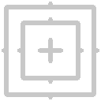

TrackerPM
=========

*This documentation is for version 1.0 of TrackerPM.*

Point tracker based on pattern matching using an exhaustive search within an image region.

The Mask input is used to weight the pattern, so that only pixels from the Mask will be tracked.

The tracker always takes the previous/next frame as reference when searching for a pattern in an image. This can overtime make a track drift from its original pattern.

Canceling a tracking operation will not wipe all the data analysed so far. If you resume a previously canceled tracking, the tracker will continue tracking, picking up the previous/next frame as reference.

Inputs
------

+----------+---------------+------------+
| Input    | Description   | Optional   |
+==========+===============+============+
| Source   | Source        | No         |
+----------+---------------+------------+
| Mask     | Mask          | Yes        |
+----------+---------------+------------+

Controls
--------

+--------------------------------+------------------------------------+-----------+-----------------+-----------------------------------------------------------------------------------------------------------------------------------------------------------------------------------------------------------------------------------------------------------------------------------------------------------------------------------------------------------------------------------------------------------------------------------------------------------------------------------------------------------------------------------------------------------------------------------------------------------------------------------------------------------------------------------------------------------+
| Label (UI Name)                | Script-Name                        | Type      | Default-Value   | Function                                                                                                                                                                                                                                                                                                                                                                                                                                                                                                                                                                                                                                                                                                  |
+================================+====================================+===========+=================+===========================================================================================================================================================================================================================================================================================================================================================================================================================================================================================================================================================================================================================================================================================================+
| Track Name                     | NatronOfxParamStringSublabelName   | String    | Track           | The name of the track, as it appears in the user interface.                                                                                                                                                                                                                                                                                                                                                                                                                                                                                                                                                                                                                                               |
+--------------------------------+------------------------------------+-----------+-----------------+-----------------------------------------------------------------------------------------------------------------------------------------------------------------------------------------------------------------------------------------------------------------------------------------------------------------------------------------------------------------------------------------------------------------------------------------------------------------------------------------------------------------------------------------------------------------------------------------------------------------------------------------------------------------------------------------------------------+
| Track Backward                 | trackBackward                      | Button    | N/A             | Track pattern to the beginning of the sequence                                                                                                                                                                                                                                                                                                                                                                                                                                                                                                                                                                                                                                                            |
+--------------------------------+------------------------------------+-----------+-----------------+-----------------------------------------------------------------------------------------------------------------------------------------------------------------------------------------------------------------------------------------------------------------------------------------------------------------------------------------------------------------------------------------------------------------------------------------------------------------------------------------------------------------------------------------------------------------------------------------------------------------------------------------------------------------------------------------------------------+
| Track Previous                 | trackPrevious                      | Button    | N/A             | Track pattern to previous frame                                                                                                                                                                                                                                                                                                                                                                                                                                                                                                                                                                                                                                                                           |
+--------------------------------+------------------------------------+-----------+-----------------+-----------------------------------------------------------------------------------------------------------------------------------------------------------------------------------------------------------------------------------------------------------------------------------------------------------------------------------------------------------------------------------------------------------------------------------------------------------------------------------------------------------------------------------------------------------------------------------------------------------------------------------------------------------------------------------------------------------+
| Track Next                     | trackNext                          | Button    | N/A             | Track pattern to next frame                                                                                                                                                                                                                                                                                                                                                                                                                                                                                                                                                                                                                                                                               |
+--------------------------------+------------------------------------+-----------+-----------------+-----------------------------------------------------------------------------------------------------------------------------------------------------------------------------------------------------------------------------------------------------------------------------------------------------------------------------------------------------------------------------------------------------------------------------------------------------------------------------------------------------------------------------------------------------------------------------------------------------------------------------------------------------------------------------------------------------------+
| Track Forward                  | trackForward                       | Button    | N/A             | Track pattern to the end of the sequence                                                                                                                                                                                                                                                                                                                                                                                                                                                                                                                                                                                                                                                                  |
+--------------------------------+------------------------------------+-----------+-----------------+-----------------------------------------------------------------------------------------------------------------------------------------------------------------------------------------------------------------------------------------------------------------------------------------------------------------------------------------------------------------------------------------------------------------------------------------------------------------------------------------------------------------------------------------------------------------------------------------------------------------------------------------------------------------------------------------------------------+
| Center                         | center                             | Double    | x: 0.5 y: 0.5   | The center point to track                                                                                                                                                                                                                                                                                                                                                                                                                                                                                                                                                                                                                                                                                 |
+--------------------------------+------------------------------------+-----------+-----------------+-----------------------------------------------------------------------------------------------------------------------------------------------------------------------------------------------------------------------------------------------------------------------------------------------------------------------------------------------------------------------------------------------------------------------------------------------------------------------------------------------------------------------------------------------------------------------------------------------------------------------------------------------------------------------------------------------------------+
| Offset                         | offset                             | Double    | x: 0 y: 0       | The offset applied to the center point relative to the real tracked position                                                                                                                                                                                                                                                                                                                                                                                                                                                                                                                                                                                                                              |
+--------------------------------+------------------------------------+-----------+-----------------+-----------------------------------------------------------------------------------------------------------------------------------------------------------------------------------------------------------------------------------------------------------------------------------------------------------------------------------------------------------------------------------------------------------------------------------------------------------------------------------------------------------------------------------------------------------------------------------------------------------------------------------------------------------------------------------------------------------+
| Reference Frame                | refFrame                           | Integer   | 0               | The frame from which the pattern should be sampled                                                                                                                                                                                                                                                                                                                                                                                                                                                                                                                                                                                                                                                        |
+--------------------------------+------------------------------------+-----------+-----------------+-----------------------------------------------------------------------------------------------------------------------------------------------------------------------------------------------------------------------------------------------------------------------------------------------------------------------------------------------------------------------------------------------------------------------------------------------------------------------------------------------------------------------------------------------------------------------------------------------------------------------------------------------------------------------------------------------------------+
| Enable Reference Frame         | enableRefFrame                     | Boolean   | Off             | When checked, the reference frame will be the frame indicated by the Reference Frame parameter                                                                                                                                                                                                                                                                                                                                                                                                                                                                                                                                                                                                            |
+--------------------------------+------------------------------------+-----------+-----------------+-----------------------------------------------------------------------------------------------------------------------------------------------------------------------------------------------------------------------------------------------------------------------------------------------------------------------------------------------------------------------------------------------------------------------------------------------------------------------------------------------------------------------------------------------------------------------------------------------------------------------------------------------------------------------------------------------------------+
| Correlation                    | correlation                        | Double    | 0               | The correlation score of the track with respect to the pattern                                                                                                                                                                                                                                                                                                                                                                                                                                                                                                                                                                                                                                            |
+--------------------------------+------------------------------------+-----------+-----------------+-----------------------------------------------------------------------------------------------------------------------------------------------------------------------------------------------------------------------------------------------------------------------------------------------------------------------------------------------------------------------------------------------------------------------------------------------------------------------------------------------------------------------------------------------------------------------------------------------------------------------------------------------------------------------------------------------------------+
| Pattern Bottom Left            | patternBoxBtmLeft                  | Double    | x: -15 y: -15   | The bottom left corner of the inner pattern box. The coordinates are relative to the center point.                                                                                                                                                                                                                                                                                                                                                                                                                                                                                                                                                                                                        |
+--------------------------------+------------------------------------+-----------+-----------------+-----------------------------------------------------------------------------------------------------------------------------------------------------------------------------------------------------------------------------------------------------------------------------------------------------------------------------------------------------------------------------------------------------------------------------------------------------------------------------------------------------------------------------------------------------------------------------------------------------------------------------------------------------------------------------------------------------------+
| Pattern Top Right              | patternBoxTopRight                 | Double    | x: 15 y: 15     | The top right corner of the inner pattern box. The coordinates are relative to the center point.                                                                                                                                                                                                                                                                                                                                                                                                                                                                                                                                                                                                          |
+--------------------------------+------------------------------------+-----------+-----------------+-----------------------------------------------------------------------------------------------------------------------------------------------------------------------------------------------------------------------------------------------------------------------------------------------------------------------------------------------------------------------------------------------------------------------------------------------------------------------------------------------------------------------------------------------------------------------------------------------------------------------------------------------------------------------------------------------------------+
| Search Area Bottom Left        | searchBoxBtmLeft                   | Double    | x: -25 y: -25   | The bottom left corner of the search area. The coordinates are relative to the center point.                                                                                                                                                                                                                                                                                                                                                                                                                                                                                                                                                                                                              |
+--------------------------------+------------------------------------+-----------+-----------------+-----------------------------------------------------------------------------------------------------------------------------------------------------------------------------------------------------------------------------------------------------------------------------------------------------------------------------------------------------------------------------------------------------------------------------------------------------------------------------------------------------------------------------------------------------------------------------------------------------------------------------------------------------------------------------------------------------------+
| Search Area Top Right          | searchBoxTopRight                  | Double    | x: 25 y: 25     | The bottom left corner of the search area. The coordinates are relative to the center point.                                                                                                                                                                                                                                                                                                                                                                                                                                                                                                                                                                                                              |
+--------------------------------+------------------------------------+-----------+-----------------+-----------------------------------------------------------------------------------------------------------------------------------------------------------------------------------------------------------------------------------------------------------------------------------------------------------------------------------------------------------------------------------------------------------------------------------------------------------------------------------------------------------------------------------------------------------------------------------------------------------------------------------------------------------------------------------------------------------+
| Score                          | score                              | Choice    | SAD             | Correlation score computation method                                                                                                                                                                                                                                                                                                                                                                                                                                                                                                                                                                                                                                                                      |
+--------------------------------+------------------------------------+-----------+-----------------+-----------------------------------------------------------------------------------------------------------------------------------------------------------------------------------------------------------------------------------------------------------------------------------------------------------------------------------------------------------------------------------------------------------------------------------------------------------------------------------------------------------------------------------------------------------------------------------------------------------------------------------------------------------------------------------------------------------+
| Label                          | userTextArea                       | String    | N/A             | This label gets appended to the node name on the node graph.                                                                                                                                                                                                                                                                                                                                                                                                                                                                                                                                                                                                                                              |
+--------------------------------+------------------------------------+-----------+-----------------+-----------------------------------------------------------------------------------------------------------------------------------------------------------------------------------------------------------------------------------------------------------------------------------------------------------------------------------------------------------------------------------------------------------------------------------------------------------------------------------------------------------------------------------------------------------------------------------------------------------------------------------------------------------------------------------------------------------+
| Mask                           | enableMask\_Mask                   | Boolean   | Off             | Enable the mask to come from the channel named by the choice parameter on the right. Turning this off will act as though the mask was disconnected.                                                                                                                                                                                                                                                                                                                                                                                                                                                                                                                                                       |
+--------------------------------+------------------------------------+-----------+-----------------+-----------------------------------------------------------------------------------------------------------------------------------------------------------------------------------------------------------------------------------------------------------------------------------------------------------------------------------------------------------------------------------------------------------------------------------------------------------------------------------------------------------------------------------------------------------------------------------------------------------------------------------------------------------------------------------------------------------+
|                                | maskChannel\_Mask                  | Choice    | RGBA.A          | Use this channel from the original input to mix the output with the original input. Setting this to None is the same as disconnecting the input.                                                                                                                                                                                                                                                                                                                                                                                                                                                                                                                                                          |
+--------------------------------+------------------------------------+-----------+-----------------+-----------------------------------------------------------------------------------------------------------------------------------------------------------------------------------------------------------------------------------------------------------------------------------------------------------------------------------------------------------------------------------------------------------------------------------------------------------------------------------------------------------------------------------------------------------------------------------------------------------------------------------------------------------------------------------------------------------+
| Hide inputs                    | hideInputs                         | Boolean   | Off             | When checked, the input arrows of the node in the nodegraph will be hidden                                                                                                                                                                                                                                                                                                                                                                                                                                                                                                                                                                                                                                |
+--------------------------------+------------------------------------+-----------+-----------------+-----------------------------------------------------------------------------------------------------------------------------------------------------------------------------------------------------------------------------------------------------------------------------------------------------------------------------------------------------------------------------------------------------------------------------------------------------------------------------------------------------------------------------------------------------------------------------------------------------------------------------------------------------------------------------------------------------------+
| Force caching                  | forceCaching                       | Boolean   | Off             | When checked, the output of this node will always be kept in the RAM cache for fast access of already computed images.                                                                                                                                                                                                                                                                                                                                                                                                                                                                                                                                                                                    |
+--------------------------------+------------------------------------+-----------+-----------------+-----------------------------------------------------------------------------------------------------------------------------------------------------------------------------------------------------------------------------------------------------------------------------------------------------------------------------------------------------------------------------------------------------------------------------------------------------------------------------------------------------------------------------------------------------------------------------------------------------------------------------------------------------------------------------------------------------------+
| Preview                        | enablePreview                      | Boolean   | Off             | Whether to show a preview on the node box in the node-graph.                                                                                                                                                                                                                                                                                                                                                                                                                                                                                                                                                                                                                                              |
+--------------------------------+------------------------------------+-----------+-----------------+-----------------------------------------------------------------------------------------------------------------------------------------------------------------------------------------------------------------------------------------------------------------------------------------------------------------------------------------------------------------------------------------------------------------------------------------------------------------------------------------------------------------------------------------------------------------------------------------------------------------------------------------------------------------------------------------------------------+
| Disable                        | disableNode                        | Boolean   | Off             | When disabled, this node acts as a pass through.                                                                                                                                                                                                                                                                                                                                                                                                                                                                                                                                                                                                                                                          |
+--------------------------------+------------------------------------+-----------+-----------------+-----------------------------------------------------------------------------------------------------------------------------------------------------------------------------------------------------------------------------------------------------------------------------------------------------------------------------------------------------------------------------------------------------------------------------------------------------------------------------------------------------------------------------------------------------------------------------------------------------------------------------------------------------------------------------------------------------------+
| Render high def. upstream      | highDefUpstream                    | Boolean   | Off             | This node does not support rendering images at a scale lower than 1, it can only render high definition images. When checked this parameter controls whether the rest of the graph upstream should be rendered with a high quality too or at the most optimal resolution for the current viewer's viewport. Typically checking this means that an image will be slow to be rendered, but once rendered it will stick in the cache whichever zoom level you are using on the Viewer, whereas when unchecked it will be much faster to render but will have to be recomputed when zooming in/out in the Viewer.                                                                                             |
+--------------------------------+------------------------------------+-----------+-----------------+-----------------------------------------------------------------------------------------------------------------------------------------------------------------------------------------------------------------------------------------------------------------------------------------------------------------------------------------------------------------------------------------------------------------------------------------------------------------------------------------------------------------------------------------------------------------------------------------------------------------------------------------------------------------------------------------------------------+
| Lifetime Range                 | nodeLifeTime                       | Integer   | x: 0 y: 0       | This is the frame range during which the node will be active if Enable Lifetime is checked                                                                                                                                                                                                                                                                                                                                                                                                                                                                                                                                                                                                                |
+--------------------------------+------------------------------------+-----------+-----------------+-----------------------------------------------------------------------------------------------------------------------------------------------------------------------------------------------------------------------------------------------------------------------------------------------------------------------------------------------------------------------------------------------------------------------------------------------------------------------------------------------------------------------------------------------------------------------------------------------------------------------------------------------------------------------------------------------------------+
| Enable Lifetime                | enableNodeLifeTime                 | Boolean   | Off             | When checked, the node is only active during the specified frame range by the Lifetime Range parameter. Outside of this frame range, it behaves as if the Disable parameter is checked                                                                                                                                                                                                                                                                                                                                                                                                                                                                                                                    |
+--------------------------------+------------------------------------+-----------+-----------------+-----------------------------------------------------------------------------------------------------------------------------------------------------------------------------------------------------------------------------------------------------------------------------------------------------------------------------------------------------------------------------------------------------------------------------------------------------------------------------------------------------------------------------------------------------------------------------------------------------------------------------------------------------------------------------------------------------------+
| After param changed callback   | onParamChanged                     | String    | N/A             | Set here the name of a function defined in Python which will be called for each parameter change. Either define this function in the Script Editor or in the init.py script or even in the script of a Python group plug-in.The signature of the callback is: callback(thisParam, thisNode, thisGroup, app, userEdited) where:- thisParam: The parameter which just had its value changed- userEdited: A boolean informing whether the change was due to user interaction or because something internally triggered the change.- thisNode: The node holding the parameter- app: points to the current application instance- thisGroup: The group holding thisNode (only if thisNode belongs to a group)   |
+--------------------------------+------------------------------------+-----------+-----------------+-----------------------------------------------------------------------------------------------------------------------------------------------------------------------------------------------------------------------------------------------------------------------------------------------------------------------------------------------------------------------------------------------------------------------------------------------------------------------------------------------------------------------------------------------------------------------------------------------------------------------------------------------------------------------------------------------------------+
| After input changed callback   | onInputChanged                     | String    | N/A             | Set here the name of a function defined in Python which will be called after each connection is changed for the inputs of the node. Either define this function in the Script Editor or in the init.py script or even in the script of a Python group plug-in.The signature of the callback is: callback(inputIndex, thisNode, thisGroup, app):- inputIndex: the index of the input which changed, you can query the node connected to the input by calling the getInput(...) function.- thisNode: The node holding the parameter- app: points to the current application instance- thisGroup: The group holding thisNode (only if thisNode belongs to a group)                                           |
+--------------------------------+------------------------------------+-----------+-----------------+-----------------------------------------------------------------------------------------------------------------------------------------------------------------------------------------------------------------------------------------------------------------------------------------------------------------------------------------------------------------------------------------------------------------------------------------------------------------------------------------------------------------------------------------------------------------------------------------------------------------------------------------------------------------------------------------------------------+
|                                | nodeInfos                          | String    | N/A             | Input and output informations, press Refresh to update them with current values                                                                                                                                                                                                                                                                                                                                                                                                                                                                                                                                                                                                                           |
+--------------------------------+------------------------------------+-----------+-----------------+-----------------------------------------------------------------------------------------------------------------------------------------------------------------------------------------------------------------------------------------------------------------------------------------------------------------------------------------------------------------------------------------------------------------------------------------------------------------------------------------------------------------------------------------------------------------------------------------------------------------------------------------------------------------------------------------------------------+
| Refresh Info                   | refreshButton                      | Button    | N/A             |                                                                                                                                                                                                                                                                                                                                                                                                                                                                                                                                                                                                                                                                                                           |
+--------------------------------+------------------------------------+-----------+-----------------+-----------------------------------------------------------------------------------------------------------------------------------------------------------------------------------------------------------------------------------------------------------------------------------------------------------------------------------------------------------------------------------------------------------------------------------------------------------------------------------------------------------------------------------------------------------------------------------------------------------------------------------------------------------------------------------------------------------+
