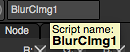
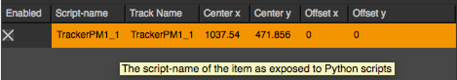
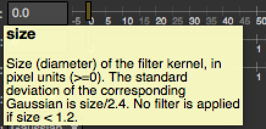
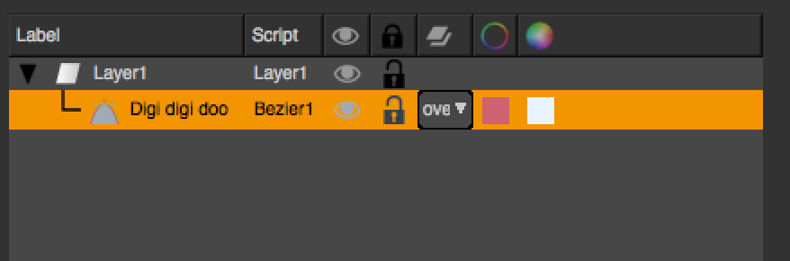

.. _autovar:

Python Auto-declared variables
==============================

A lot of Python variables are pre-declared by Natron upon the creation of specific objects.
This applies currently to the following objects:

	*	:doc:`PythonReference/NatronEngine/Effect`
	*	:doc:`PythonReference/NatronEngine/Layer`
	*	:doc:`PythonReference/NatronEngine/BezierCurve`
	*	:doc:`PythonReference/NatronEngine/App`
	*	:doc:`PythonReference/NatronEngine/PyCoreApplication`
	
The idea is that it is simpler to access a simple variable like this::
	
	node = app1.Blur1
	
rather than call a bunch of functions such as::

	node = app1.getNode("app1.Blur1")
	
To achieve this, auto-declared objects must be named with a correct syntax in
a python script.
For instance, the following variable would not work in Python::

	>>> my variable = 2
	File "<stdin>", line 1
	my variable = 2
              ^
	SyntaxError: invalid syntax 
	
But the following would work::

	>>> myVariable = 2

To overcome this issue, all auto-declared variables in Natron have 2 names:

	1. A script-name: The name that will be used to auto-declare the variable to Python.
	This name cannot be changed and is set once by Natron the first time the object is
	created. This name contains only alpha-numeric characters and does not start
	with a digit.
	
	2. A label: The label is what is displayed on the graphical user interface. For example
	the node label is visible in the node graph. This label can contain any character 
	without any restriction.

Basically there can only ever be one instance of an object with a *script-name* (so it is 
identified uniquely) but several instances of this object could have the same *label*.

Generally when calling a function which takes an object name in parameter, you pass it always
the script-name of the object.
See for example :func:`getParam(name)<NatronEngine.Effect.getParam>`.

.. _nodeScriptName:

Knowing the script-name of a node:
----------------------------------

The script-name of a node is visible in the graphical-user interface in the tool-tip of 
the widget to edit the *label* of the node:

	
	
For children nodes (like tracks) you can access their script-name from the table of the Tracker
node:

	
In command-line mode or via the *Script Editor*, you can also get the script-name of the node
with the :func:`getScriptName()<>` function of the :doc:`PythonReference/NatronEngine/Effect` class.

.. _paramScriptName:

Knowing the script-name of a parameter:
---------------------------------------

In the settings panel of a node, the script-name of a parameter is visible in *bold* in the
tooltip displayed when hovering a parameter with the mouse:

	
In command-line mode or via the *Script Editor* you can also get the script-name of the parameter
with the :func:`getScriptName()<>` function of the :doc:`PythonReference/NatronEngine/Param` class.

.. _rotoScriptName:

Knowing the script-name of an item of a Roto node:
--------------------------------------------------

In the settings panel of a roto node, the script-name of an item is visible in the *Script* column of the table:

	
In command-line mode or via the *Script Editor* you can also get the script-name of an item
with the :func:`getScriptName()<>` function of the :doc:`PythonReference/NatronEngine/ItemBase` class.