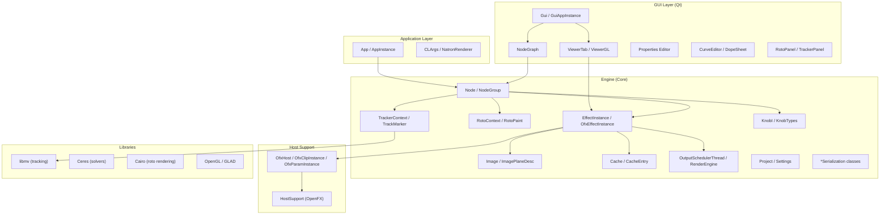

# Natron vs Nuke: Gap Analysis for Production Readiness

## Executive Summary

After thorough inspection of the Natron RB-2.6 codebase (~600+ source files across Engine, Gui, Global, Renderer, HostSupport, and libs), this document identifies the structural and feature gaps that prevent Natron from being a credible alternative to Nuke in professional VFX production.

**Key Findings:**

1. **Natron's architecture is fundamentally sound** for 2D compositing. The Engine/Gui separation, OFX host support, OIIO/OCIO integration, and node-graph paradigm are well-implemented.
2. **The biggest gaps are NOT in missing nodes** — they are in **infrastructure**: cache reliability, multi-layer EXR ergonomics, channel management, viewer UX, and stability at scale.
3. **3D is the most visible gap** but also the highest-risk/effort undertaking. A phased approach starting with 2.5D (card/projection) is far more realistic than a full 3D scene graph.
4. **Performance and stability** under production workloads (500+ node scripts, heavy EXR sequences) are the #1 blockers for adoption.
5. **Many "missing features" are actually OFX plugin gaps**, not core application gaps. The analysis carefully distinguishes between the two.

---

## Architectural Map of Natron RB-2.6

### Key Module Sizes (indicating complexity/coupling)

| Module | Files | Key Hot Files (>100KB) |
|--------|-------|----------------------|
| **Engine** | 329 | `Node.cpp` (240K), `EffectInstance.cpp` (237K), `Knob.cpp` (196K), `Settings.cpp` (170K), `RotoContext.cpp` (181K), `RotoPaint.cpp` (153K), `ViewerInstance.cpp` (140K), `OutputSchedulerThread.cpp` (143K), `TrackerNode.cpp` (127K) |
| **Gui** | 294 | `ViewerGL.cpp` (168K), `NodeGui.cpp` (130K), `DopeSheetView.cpp` (132K), `RotoPanel.cpp` (110K), `MultiInstancePanel.cpp` (91K) |
| **Global** | 22 | `Macros.h` (31K) |
| **Tests** | 15 | Very minimal coverage |

> [!WARNING]
> The test suite is critically underpopulated: only 7 test files covering Curve, FileSystem, Hash, Image, KnobFile, Lut, and Tracker. **No integration tests, no rendering validation tests, no GUI tests.** This is the single biggest risk factor for any development effort.

---

## Priority Classification

### P0 — Production-Critical (Without these, no studio will adopt)

| # | Feature | Problem It Solves | Why Critical | Dependencies | Risk | Effort | Impact |
|---|---------|-------------------|-------------|--------------|------|--------|--------|
| 1 | **Cache System Overhaul** | Natron's LRU cache (`Cache.h`, 1915 lines, heavily templated) causes memory bloat, stalls on large scripts, and provides no visibility into what's cached | Compositors lose hours to unpredictable cache behavior; playback stalls mid-session | Refactor `CacheEntry`, `LRUHashTable`, `TileCacheFile` | High — central to everything | XL | **Alto** |
| 2 | **Multi-layer EXR / AOV Ergonomics** | Reading a 20-layer EXR requires manual Shuffle nodes for each AOV. No layer picker, no visual inspection of available passes | CG compositing (80%+ of VFX work) is impossible without ergonomic multi-layer handling | `ImagePlaneDesc` already has plane concept but UI is primitive; `ReadNode.cpp` (50K) needs major layer-aware UI | Medium | L | **Alto** |
| 3 | **Stability at Scale** | Scripts >200 nodes cause hangs, rendering artifacts, serialization corruption. `Node.cpp` (240K) and `EffectInstance.cpp` (237K) have deep recursive call chains | Professionals need to trust the tool won't crash after 8 hours of work | Thread safety audit of TLS system (`TLSHolder`, `ParallelRenderArgs`), memory leak fixes | High — systemic | XL | **Alto** |
| 4 | **Predictable Rendering** | Non-deterministic results from multi-threaded renders, NaN propagation issues, bitmap-based trimap system can produce rendering artifacts | Artists must get the same result every time they hit render | Fix `EffectInstanceRenderRoI.cpp` (103K), bitmap/trimap consistency, NaN handling in `Settings` | Medium | L | **Alto** |
| 5 | **Channel Management Modernization** | Shuffle node is primitive; no visual channel inspector; no quick-switch between layers; channel naming is inconsistent with EXR conventions | Every single comp touches channels; friction here multiplies across every task | `ImagePlaneDesc`, `ChannelsComboBox`, OFX multi-plane extension hooks (`nuke/fnOfxExtensions.h`) | Low | M | **Alto** |

### P1 — Daily Workflow (Blocks efficient professional use)

| # | Feature | Problem It Solves | Why Critical | Dependencies | Risk | Effort | Impact |
|---|---------|-------------------|-------------|--------------|------|--------|--------|
| 6 | **Viewer UX Overhaul** | No per-layer quick view, no wipe compare with exposure control, no OCIO display in viewer header, limited zoom/pan smoothness | The viewer is where 90% of compositing decisions happen | `ViewerGL.cpp` (168K), `ViewerTab*.cpp` (~150K combined), `ViewerInstance.cpp` (140K) — massive coupling | Medium | L | **Alto** |
| 7 | **Background Rendering & Queue** | `Renderer/NatronRenderer_main.cpp` is minimal; no job queue, no farm submission hooks, no render progress API | Studios need to submit renders and walk away | `OutputSchedulerThread`, `ProcessHandler`, CLI pipeline | Low | M | **Alto** |
| 8 | **Expression Engine Enhancement** | Current expression system is limited Python eval; no TCL expr compatibility, no cross-node value inspection, limited math functions | TDs and senior compositors rely heavily on expressions for procedural control | `PyExprUtils.cpp` (11K), Knob expression evaluation in `Knob.cpp` / `KnobImpl.h` | Medium | M | **Medio** |
| 9 | **Graph UX: Bookmarks, Sticky Notes, Navigation** | No bookmarks, no node search-navigation, no graph "minimap", no sticky notes (only Backdrop exists), no node versioning | Navigating 500-node scripts is painful; knowledge is lost between sessions | `NodeGraph*.cpp` (9 files ~160K combined), `BackdropGui.cpp` | Low | M | **Medio** |
| 10 | **Proxy / ROI / Draft Mode** | Proxy system exists but is fragile; ROI works but no "focus region" concept; draft mode is binary on/off | Interactive work on 4K+ footage is painfully slow without reliable proxy | `RenderScale`, Viewer mipmap level, `EffectInstance::RenderRoIArgs` | Low | M | **Alto** |
| 11 | **Keying / Despill / Edge Tools** | No built-in IBK, no Keylight equivalent; available OFX keyers are basic; no edge extend, no edge blur optimized for keying | Keying is the most common daily task; without quality core keyers, Natron fails the basic test | Can mostly be OFX plugins, but needs core despill/edge infrastructure in `MergingEnum`, `ImageCopyChannels` | Low (OFX) | M | **Alto** |
| 12 | **Roto/Paint UX (pressure, performance)** | `RotoContext.cpp` (181K) + `RotoPaintInteract.cpp` (72K) are massive but the UX lags behind: slow on complex shapes, poor pressure curve control, no motion blur on shapes | Roto artists won't switch without competitive roto tools | Cairo-based rasterizer, `BezierCP`, stroke rendering pipeline | Medium | L | **Medio** |

### P2 — Adoption Multipliers (Makes Natron attractive beyond basic use)

| # | Feature | Problem It Solves | Why Critical | Dependencies | Risk | Effort | Impact |
|---|---------|-------------------|-------------|--------------|------|--------|--------|
| 13 | **2.5D / Card / Projection Workflow** | No 3D card, no camera projection, no frustum-based compose. This is the single most visible feature gap in marketing terms | Set extensions, matte paintings, 2.5D setups are bread-and-butter work that currently requires leaving Natron | **Requires new rendering abstraction**: Camera node, Card node, ScanlineRender-style rasterizer; touches `Image`, `EffectInstance`, `ViewerGL` | **Very High** | XL | **Alto** |
| 14 | **Camera Tracker / Matchmove Interop** | Built-in tracker (`TrackerContext`, `libmv`) does 2D only; no 3D solve, no camera export to standard formats | Camera tracking is top-5 task; without 3D solve or interop (3DE, SynthEyes .chan files), Natron is incomplete | `TrackerContext.cpp` (62K), `TrackerContextPrivate.cpp` (117K), camera solve would need new solver | High | XL | **Medio** |
| 15 | **PyPlug / Gizmo / Preset Ecosystem** | Group export works (`exportGroupToPython`) but no repository, no version management, no dependency resolution, no auto-install | Community-contributed tools are the lifeblood of an open compositor | `NodeGroup.h`, PyPlug infrastructure, plugin paths in `Settings` | Low | M | **Medio** |
| 16 | **Deep Compositing** | No deep image support at all; `Image.h` handles flat buffers only, no deep sample storage | Deep comp is used in major facility pipelines, especially for volumetrics and holdouts | Would require new `DeepImage` class, deep merge, deep EXR IO via OIIO — fundamental architectural addition | **Very High** | XL | **Medio** |
| 17 | **Pipeline Integration (USD/Alembic metadata, CLI hooks)** | No USD support, no Alembic geometric data passthrough, limited CLI automation beyond basic render | Studios need Natron to fit into automated pipelines | New node types, metadata passthrough in `NodeMetadata`, CLI extensions in `CLArgs.cpp` (48K) | Medium | L | **Medio** |
| 18 | **Performance Profiling & Debug Tooling** | `RenderStats.cpp` (12K) and `RenderStatsDialog.cpp` (42K) exist but are too basic; no per-node timing breakdown, no memory profiling | Problems are invisible; can't optimize what you can't measure | Extend `RenderStats`, add per-node instrumentation in render pipeline | Low | M | **Medio** |
| 19 | **Version Compare / A-B Viewer** | Viewer has A|B input switch but no snapshotting, no version comparison, no render-state comparison | Essential for iterative work: "is my change better or worse?" | `ViewerInstance`, `ViewerGL` overlay system | Low | S | **Medio** |

### P3 — Nice-to-Have / Secondary Parity

| # | Feature | Problem It Solves | Dependencies | Risk | Effort | Impact |
|---|---------|-------------------|-------------|------|--------|--------|
| 20 | **Stereo Workflow** | Basic stereo support exists (`JoinViewsNode`, `OneViewNode`, `ViewIdx`) but is incomplete | View management, per-view rendering | Medium | L | **Basso** |
| 21 | **Motion Blur on Transforms** | OFX Transform has motion blur but it's per-plugin; no centralized motion vector based blur | Transform concatenation system | Low | M | **Basso** |
| 22 | **Smart Vector / Spline Warp** | No SmartVector equivalent; limited warping tools | Would be OFX plugin; needs vector field infrastructure | Medium | L | **Basso** |
| 23 | **Color Picker Enhancements** | Basic picker works; no persistent sample, no n-point average, no scope integration | `ColorSelectorWidget.cpp`, Viewer overlay | Low | S | **Basso** |
| 24 | **Particle System** | Not available; Nuke's is basic anyway | Would need entirely new system; low priority | Very High | XL | **Basso** |
| 25 | **Advanced Scopes** | Histogram exists (`Histogram.cpp`, 74K); no vectorscope, no waveform | `HistogramCPU.cpp`, OpenGL rendering | Low | M | **Basso** |

---

## What to Build First

> [!IMPORTANT]
> **The correct order is: Foundation → Workflow → Features.** Building 3D on top of an unstable cache and poor channel management is a recipe for expensive failure.

### Priority Stack (in order):
1. **Cache system hardening** (P0-1) — Everything downstream depends on this
2. **Multi-layer EXR / AOV ergonomics** (P0-2) — Unlocks CG compositing
3. **Channel management modernization** (P0-5) — Enables efficient layer work
4. **Viewer UX improvements** (P1-6) — Makes evaluation fast and reliable
5. **Stability and rendering predictability** (P0-3, P0-4) — Trust
6. **Background rendering** (P1-7) — Pipeline integration
7. **Keying / despill / edge (as OFX bundle)** (P1-11) — Fills the toolbox
8. **Graph UX improvements** (P1-9) — Scales to large scripts
9. **2.5D card/projection** (P2-13) — The "wow" feature

---

## What NOT to Build Yet

| Feature | Why Not Now |
|---------|------------|
| **Full 3D scene graph** | Requires GL rendering rewrite, new node categories, camera/light/geometry abstractions — 12-18 months minimum; 2.5D card workflow covers 70% of use cases |
| **Deep compositing** | Architectural prerequisite (new Image class); most indie/mid-tier studios don't use deep comp daily |
| **Particle system** | Niche use; Nuke's particles are barely used; focus on compositing core |
| **AI/ML denoising/upscale** | Better served as OFX plugins wrapping inference; not a core app concern |
| **USD scene description** | Valuable but premature without 3D; metadata passthrough is sufficient for now |
| **Full stereo pipeline** | Market is small; basic stereo support already exists |

---

## Architectural Prerequisites

Before any feature work, these refactors must happen:

### 1. Cache Architecture Refactor
- **Current**: `Cache<T>` (1915 lines, header-only template) with LRU eviction, tile-based disk cache, QMutex-based locking. Multiple lock contentions (`_lock`, `_getLock`, `_sizeLock`).
- **Problem**: Lock contention causes stalls on multi-threaded renders; no cache partitioning; no priority eviction (viewer frames evict compute cache).
- **Solution**: Separate viewer cache from compute cache; introduce lock-free concurrent data structures; add cache priority tiers; expose cache state to UI.

### 2. Image/Plane Abstraction Modernization
- **Current**: `ImagePlaneDesc` stores plane ID + channels as strings. `Image` is a flat buffer indexed by `ImagePlaneDesc`. No concept of multi-plane image (one Image = one plane).
- **Problem**: Each AOV is a separate `Image` object → O(n) lookup per plane, memory fragmentation, no atomic multi-plane write.
- **Solution**: Introduce `MultiPlaneImage` wrapper; allow `ReadNode` to expose all planes in one pass; lazy-load individual planes.

### 3. Thread Safety Audit
- **Current**: Mix of QMutex, QReadWriteLock, TLS (`TLSHolder`), and bare atomic operations. `ParallelRenderArgs` is TLS-based with complex lifecycle.
- **Problem**: Race conditions in EffectInstance render pipeline; TLS cleanup issues on thread pool resize.
- **Solution**: Systematic audit of all shared mutable state in Engine; replace QMutex with std::shared_mutex where appropriate; simplify TLS lifecycle.

### 4. Serialization Modernization
- **Current**: Boost.Serialization with version macros (`BOOST_CLASS_VERSION`). XML-based archive. Spread across `*Serialization.h` files.
- **Problem**: Brittle versioning; no forward compatibility; no migration tooling; adding new fields risks breaking old projects.
- **Solution**: Add a JSON/protobuf side-path for new data; maintain Boost reader for backward compat; version bump with explicit migration code.

### 5. Test Infrastructure
- **Current**: 7 unit test files, Google Test/Mock. No CI rendering validation.
- **Solution**: Add rendering regression suite (golden image comparison); add OFX plugin mock tests; add Python API tests; add large-script stress tests.

---

## Quick Wins in 30 Days

These can be done without architectural changes:

| # | Win | Effort | Impact | Files to Modify |
|---|-----|--------|--------|-----------------|
| 1 | **Layer/AOV dropdown in Viewer** — quick switch between available planes | 3 days | High | `ViewerTab.cpp`, `ViewerInstance::setActiveLayer()`, `ChannelsComboBox.cpp` |
| 2 | **Node search/jump hotkey** (Ctrl+G style) in node graph | 2 days | Medium | `NodeCreationDialog.cpp`, `NodeGraph.cpp` |
| 3 | **Render progress in title bar** | 1 day | Low | `Gui.cpp`, `OutputSchedulerThread` signals |
| 4 | **Cache usage indicator** — show memory/disk usage in status bar | 2 days | Medium | `Gui.cpp`, `Cache::getMemoryCacheSize()` |
| 5 | **Keyboard shortcut for "Solo channel"** in viewer | 1 day | Medium | `ViewerTab30.cpp`, `ActionShortcuts` |
| 6 | **Sticky notes** (simple text nodes on graph, distinct from Backdrop) | 3 days | Medium | New `StickyNote` class extending `Backdrop` |
| 7 | **Copy/Paste node with expressions** — preserve expression links | 3 days | High | `NodeGraphUndoRedo.cpp`, `NodeClipBoard.h` |
| 8 | **Frame range indicator on Read nodes** | 1 day | Low | `NodeGui.cpp`, read node frame range knob |
| 9 | **Auto-save indicator** in title bar | 0.5 days | Low | `Gui.cpp` |
| 10 | **Crash recovery improvement** — better auto-save before crash | 2 days | High | `BreakpadClient`, `Project::autoSave()` |

---

## 12-Month Roadmap

See [natron_roadmap.md](file:///Users/davidepace/.gemini/antigravity/brain/471167d8-6d45-4cab-83b2-49906efe63ac/natron_roadmap.md) for the full roadmap.

---

## Risks and Tradeoffs

### Technical Risks

| Risk | Likelihood | Impact | Mitigation |
|------|-----------|--------|------------|
| Cache refactor breaks existing projects | Medium | Critical | Feature-flagged rollout; extensive A/B testing with production scenes |
| OFX API limitations block multi-plane improvements | Low | High | Use Natron's own OFX extensions (`nuke/fnOfxExtensions.h` already exists) |
| 3D/2.5D implementation scope creep | High | High | Hard-scope to Card + Camera + ScanlineRender only; no geometry, no lights, no shaders |
| Community fragmentation due to API changes | Medium | Medium | Semantic versioning; deprecation warnings; migration guides |
| Qt version lock (currently supporting Qt5+Qt6) | Low | Medium | Current dual-Qt support via `QtCompat.h` is adequate |

### Strategic Tradeoffs

| Tradeoff | Chosen Path | Rationale |
|----------|-------------|-----------|
| 3D vs 2.5D | Start with 2.5D (Card/Projection) | 70% of "3D" use cases in comp are projection-based; full 3D is 10x the effort |
| Deep vs Flat compositing | Stay flat; add deep as optional later | Deep is used by <10% of comp work; flat optimizations have higher ROI |
| Custom keyer vs OFX keyer | OFX plugin bundle | Keyers are algorithmic, not architectural; OFX is the right delivery mechanism |
| Rewrite cache vs patch cache | Staged refactor | Full rewrite risks breaking everything; staged improvement with fallback is safer |
| Python 2 vs Python 3 | Python 3 only (already done in 2.6) | Industry has moved; no backward pressure |

### What Would Make Natron Win Against Nuke

1. **Open source + stable** — Studios that can't afford Nuke licenses need to trust Natron
2. **AOV workflow excellence** — If Natron handles multi-layer EXR better than Nuke, it becomes the CG comp tool of choice
3. **Pipeline-friendly** — CLI, Python API, farm integration, OCIO — make TD adoption frictionless
4. **Community ecosystem** — Better PyPlug/preset sharing = compound network effects
5. **Performance on commodity hardware** — Nuke is optimized for high-end; Natron should excel on 32GB workstations

### What Would NOT Make Natron Win

- Copying Nuke's UI pixel-for-pixel
- Building features Nuke has but nobody uses (Particles, PlanarTracker for most users)
- Prioritizing whiz-bang features over stability
- Breaking backward compatibility for every release
