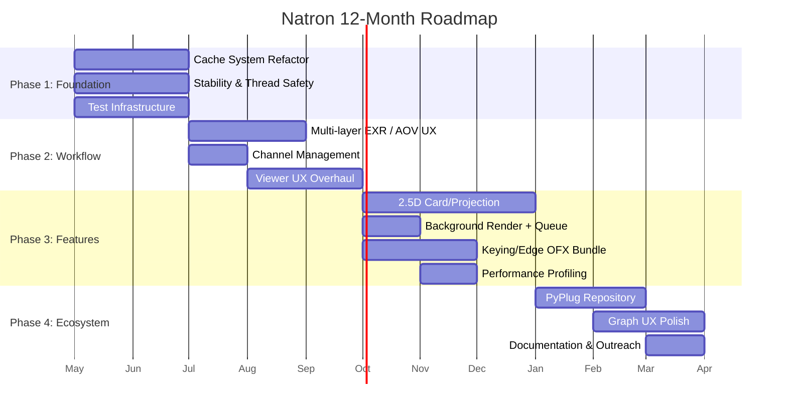

# Natron Technical Roadmap: 12-Month Plan

## Vision Statement

> Make Natron the most reliable, pipeline-friendly open-source compositor,  
> excelling at CG integration, keying, and everyday 2D/2.5D compositing workflows.

---

## Phase Overview

---

## Phase 1: Foundation (Months 1-3)

> **Goal:** Make Natron stable, predictable, and measurable. No new user-facing features — only infrastructure.

### Milestone 1.1 — Cache System Refactor

**Target:** Eliminate cache-related hangs and memory exhaustion on scripts with >100 nodes.

| Task | Description | Files | Effort |
|------|-------------|-------|--------|
| Separate viewer and compute caches | Create `ViewerCache` and `NodeCache` as distinct instances of `Cache<T>` with independent eviction policies | `Cache.h`, `AppManager.cpp`, `ViewerInstance.cpp` | 2 weeks |
| Reduce lock contention | Replace triple-mutex pattern (`_lock`, `_getLock`, `_sizeLock`) with a single reader-writer lock + atomic counters for sizes | `Cache.h` lines 480-491 | 1 week |
| Add cache priority tiers | Viewer frames = high priority, intermediate renders = low priority; evict low priority first | `CacheEntry.h`, `LRUHashTable.h` | 1 week |
| Cache state UI | Status bar widget showing RAM/disk usage, hit rate, eviction count | New `CacheStatusWidget.cpp` in Gui | 3 days |
| Tile cache file management | Fix orphaned tile cache files; add startup cleanup; cap total files | `Cache.h` allocTile/freeTile, `StandardPaths.cpp` | 1 week |

**Success Criteria:**
- [ ] 500-node benchmark script renders without cache-related hang
- [ ] Viewer playback at 24fps for 1080p RGBA float sequences (256-frame cache)
- [ ] Memory usage stays within configured limit ±5%

### Milestone 1.2 — Stability & Thread Safety

**Target:** Zero crashes on the "top 10" crash-producing workflows.

| Task | Description | Files | Effort |
|------|-------------|-------|--------|
| TLS lifecycle audit | Map all TLS usage in `TLSHolder`, `ParallelRenderArgs`; fix cleanup on thread pool resize | `TLSHolder.cpp`, `ParallelRenderArgs.cpp` | 2 weeks |
| Render hash consistency | Ensure `getHash()` and `getRenderHash()` always agree within a single render pass | `EffectInstance.h`, `Node.cpp` hash computation | 1 week |
| Trimap system hardening | Fix race conditions in `Bitmap` trimap marking; add defensive checks | `Image.cpp`, `Image.h` lines 112-131 | 1 week |
| Serialization safety | Add checksums to project files; detect and recover from partial writes | `ProjectSerialization.cpp`, `NodeSerialization.cpp` | 1 week |
| Undo/redo memory bounds | Cap undo stack by memory size, not count; prevent OOM from undo history | `NodeGraphUndoRedo.cpp`, `KnobUndoCommand.cpp` | 3 days |
| Crash reporting improvement | Better stack traces via Breakpad; auto-save 30s before crash | `BreakpadClient/`, `Project.cpp` | 1 week |

**Success Criteria:**
- [ ] 8-hour soak test with continuous render/edit cycles — zero crashes
- [ ] All known crash bugs from GitHub issues triaged and top 10 fixed
- [ ] Project file corruption rate drops to <0.1% (measured via automated test)

### Milestone 1.3 — Test Infrastructure

**Target:** Establish regression prevention baseline.

| Task | Description | Files | Effort |
|------|-------------|-------|--------|
| Rendering golden image tests | Compare render output of reference .ntp files against golden EXR files (OIIO-diff based) | New `Tests/RenderRegression/` | 2 weeks |
| Python API test suite | Exercise all `Effect`, `Param`, `Roto`, `Tracker` Python API methods | New `Tests/PythonAPI/` | 1 week |
| Large-script stress tests | Auto-generate 200/500/1000 node scripts; test load/save/render/undo | New `Tests/Stress/` | 1 week |
| CI pipeline with rendering validation | GitHub Actions or similar; build + unit test + render regression | New `.github/workflows/` | 1 week |
| OFX plugin compatibility tests | Test with openfx-misc, openfx-io, openfx-arena bundles | New `Tests/OFX/` | 3 days |

**Success Criteria:**
- [ ] CI runs on every PR with pass/fail
- [ ] >50 golden image test cases covering core operations
- [ ] Render regression detected within 24h of introduction

---

## Phase 2: Workflow (Months 4-6)

> **Goal:** Make day-to-day comp work efficient and pleasant. This is the phase that converts skeptics.

### Milestone 2.1 — Multi-layer EXR / AOV Ergonomics

**Target:** Read a 20-layer EXR and have all AOVs accessible with ≤2 clicks.

| Task | Description | Files | Effort |
|------|-------------|-------|--------|
| `MultiPlaneImage` wrapper | New class wrapping multiple `Image` objects indexed by `ImagePlaneDesc`; lazy-loaded planes | New `Engine/MultiPlaneImage.h/.cpp` | 2 weeks |
| Read node layer-aware UI | Show all available layers in Read node properties; checkbox per layer; "read all" option | `ReadNode.cpp`, `KnobGuiFile.cpp` | 2 weeks |
| Layer picker dropdown everywhere | Consistent layer selector on Viewer, Shuffle, Copy, Merge, Grade, etc. | `ChannelsComboBox.cpp`, `KnobGuiChoice.cpp`, `ViewerTab.cpp` | 1 week |
| Layer auto-connect | When connecting a multi-plane output to a single-plane input, auto-insert Shuffle | `NodeGraph::autoConnectNodes()`, `NodeInputs.cpp` | 1 week |
| Layer inspector panel | New panel showing all planes/channels in an image with thumbnails and value readout | New `Gui/LayerInspector.cpp` | 2 weeks |

**Success Criteria:**
- [ ] Open 20-layer EXR → all AOVs visible in one panel
- [ ] Switch Viewer to any AOV in ≤2 clicks
- [ ] Grade applied to `diffuse` layer without manual Shuffle setup

### Milestone 2.2 — Channel Management Modernization

**Target:** Channel operations feel as natural as Nuke's.

| Task | Description | Files | Effort |
|------|-------------|-------|--------|
| Shuffle2-style node | New Shuffle node with per-channel source picker supporting arbitrary layers | New Engine+Gui code, replaces old `ShufflePlugin` call | 2 weeks |
| Channel naming conventions | Enforce EXR-standard naming (`beauty.R`, `diffuse.R`, etc.); map non-standard names | `ImagePlaneDesc.cpp`, OFX plane mapping | 1 week |
| Copy node enhancement | Copy/move individual channels between any layers with visual preview | Extend existing OFX ShuffleCopy or new core node | 1 week |
| Layer ops (remove, rename, reorder) | Utility nodes for layer management operations | New nodes; `EffectInstance` plane handling | 1 week |

**Success Criteria:**
- [ ] AOV comp workflow (diffuse + specular + reflection + SSS + matte) achievable in <10 nodes
- [ ] Channel names survive round-trip through read → process → write

### Milestone 2.3 — Viewer UX Overhaul

**Target:** The viewer must be a joy to use, not an obstacle.

| Task | Description | Files | Effort |
|------|-------------|-------|--------|
| Layer quick-switch in viewer | Dropdown or hotkey cycle through available layers | `ViewerTab.cpp`, `ViewerInstance.cpp` | 3 days |
| OCIO display controls in viewer | Per-viewer OCIO display/view/look selection | `ViewerTab20.cpp`, `ViewerGL.cpp` shader pipeline | 1 week |
| Wipe improvements | Smooth wipe with exposure offset; hold-button wipe to previous version | `ViewerGL.cpp` wipe rendering | 1 week |
| Zoom/pan smoothing | Interpolated zoom; momentum-based pan; configurable zoom speed | `ViewerGL.cpp` mouse handling, `ZoomContext.h` | 3 days |
| Pixel inspector enhancement | Show value under cursor for all channels of current layer; persistent sample points | `InfoViewerWidget.cpp`, new `PixelProbe` class | 1 week |
| Scope integration | Inline waveform/vectorscope in viewer panel | `Histogram.cpp` extension, new `WaveformWidget` | 2 weeks |
| Viewer snapshot comparison | Save viewer state → compare later | `ViewerInstance.cpp`, new snapshot buffer | 1 week |

**Success Criteria:**
- [ ] Compositor can evaluate shot quality without leaving the viewer
- [ ] OCIO display matches reference monitor
- [ ] Wipe comparison between two versions in <2 seconds

---

## Phase 3: Features (Months 7-10)

> **Goal:** Add the capabilities that expand Natron's range beyond basic 2D comp.

### Milestone 3.1 — 2.5D Card/Projection Workflow

**Target:** Support set extension and matte painting workflows.

| Task | Description | Files | Effort |
|------|-------------|-------|--------|
| Camera node | New core node representing 3D camera (position, rotation, focal length, aperture) | New `Engine/CameraNode.h/.cpp` | 2 weeks |
| Card node | Flat plane in 3D space; position, rotation, scale; input is 2D texture | New `Engine/CardNode.h/.cpp` | 2 weeks |
| ScanlineRender-style rasterizer | Project cards through camera; Z-buffer compositing; anti-aliased edges | New `Engine/ScanlineRender.h/.cpp` | 4 weeks |
| Projection node | Projects image through camera onto geometry (initially card only) | New `Engine/ProjectNode.h/.cpp` | 2 weeks |
| Viewer 3D overlay | Show camera frustum, card positions in 2D viewer as wireframe overlay | `ViewerGL.cpp`, `HostOverlay.cpp` | 2 weeks |

**Success Criteria:**
- [ ] Matte painting projection workflow: Camera + Card + Project + ScanlineRender renders correctly
- [ ] Camera animation through scene with multiple cards produces parallax
- [ ] Z-compositing of multiple cards with proper occlusion

### Milestone 3.2 — Background Rendering & Queue

| Task | Description | Files | Effort |
|------|-------------|-------|--------|
| Render queue manager | In-app queue for sequential renders with priority ordering | New `Engine/RenderQueue.h/.cpp`, extend `ProcessHandler` | 2 weeks |
| CLI render enhancements | JSON-based render spec; progress JSON output; error reporting API | `CLArgs.cpp`, `NatronRenderer_main.cpp` | 1 week |
| Farm submission hooks | Pluggable Python-based farm submission (Deadline, Tractor, OpenCue) | New `Engine/FarmSubmit.h`, Python API extension | 1 week |

### Milestone 3.3 — Keying/Edge OFX Plugin Bundle

| Task | Description | Effort |
|------|-------------|--------|
| IBK-style keyer | Difference-based keyer with separate keyer and combiner | 3 weeks (OFX plugin) |
| Advanced despill | Spill suppression with fine/coarse control, holdout comp aware | 1 week (OFX plugin) |
| Edge extend/blur | Dilate/erode with antialiased edges; edge-aware blur for key lines | 2 weeks (OFX plugin) |
| Matte tools | Matte finesse: softness, shrink, edge detail, core/erode | 1 week (OFX plugin) |

### Milestone 3.4 — Performance Profiling

| Task | Description | Files | Effort |
|------|-------------|-------|--------|
| Per-node render timing | Record and display time spent in each node during render | `RenderStats.cpp`, `EffectInstance::renderRoI` | 1 week |
| Memory per-node breakdown | Track peak memory per node during render | `Cache.h`, new instrumentation | 1 week |
| Profile viewer panel | New panel showing timing waterfall for last render | New `Gui/ProfileViewer.cpp` | 2 weeks |
| Performance regression detection | Automated benchmark comparison in CI | New `Tests/Performance/` | 1 week |

---

## Phase 4: Ecosystem & Polish (Months 11-12)

> **Goal:** Make Natron easy to extend, share, and adopt.

### Milestone 4.1 — PyPlug Repository & Toolset Sharing

| Task | Description | Effort |
|------|-------------|--------|
| Online PyPlug repository spec | Define manifest format, versioning, dependency declaration | 1 week |
| In-app PyPlug browser | Browse, search, install PyPlugs from within Natron | 2 weeks |
| PyPlug version management | Track installed versions; update notifications; conflict detection | 1 week |

### Milestone 4.2 — Graph UX Polish

| Task | Description | Effort |
|------|-------------|--------|
| Node bookmarks | Mark nodes; Ctrl+number to jump; bookmark panel | 1 week |
| Sticky notes | Editable text notes on node graph, distinct from Backdrop | 3 days |
| Graph minimap | Overview thumbnail of full graph with viewport indicator | 1 week |
| Dependency visualization | Right-click node → "show all descendants" / "show all ancestors" highlights path | 1 week |
| Node color-coding by state | Rendering = green border, errored = red, cached = blue indicator | 3 days |

### Milestone 4.3 — Documentation & Outreach

| Task | Description | Effort |
|------|-------------|--------|
| Comprehensive user docs update | Cover all new features; tutorial-style guides for AOV workflow, 2.5D, keying | 3 weeks |
| Python API reference auto-gen | Generate from Shiboken bindings; host on readthedocs | 1 week |
| Benchmark scene library | 10+ reference scenes for regression testing and feature demonstration | 2 weeks |
| Migration guide from Nuke | Document equivalent workflows; "if you know Nuke, here's how to Natron" | 1 week |

---

## 24-Month Stretch Goals (Post-Roadmap)

These are tracked but not committed:

- [ ] **Deep compositing** — New `DeepImage` class, deep merge, deep EXR I/O
- [ ] **Camera tracker / 3D solve** — Extend `TrackerContext` with SfM solver
- [ ] **Full 3D scene** — Geometry import (Alembic), basic mesh rendering, lights
- [ ] **Advanced stereo** — Automated disparity, view interpolation
- [ ] **GPU compute** — OpenCL/CUDA/Metal kernels for core operations

---

## Project Management

### Team Requirements

| Phase | Minimum Team | Ideal Team |
|-------|-------------|------------|
| Phase 1 | 2 C++ engineers, 1 QA | 3 C++ engineers, 1 QA, 1 DevOps |
| Phase 2 | 2 C++ engineers, 1 UX | 3 C++ engineers, 1 UX designer, 1 QA |
| Phase 3 | 3 C++ engineers, 1 OFX dev | 4 C++ engineers, 1 OFX dev, 1 QA |
| Phase 4 | 1 C++ engineer, 1 writer | 2 C++ engineers, 1 technical writer, 1 community manager |

### Release Cadence

- **Monthly alpha releases** with new features behind feature flags
- **Quarterly beta releases** (end of each phase) with broader testing
- **Annual stable release** (end of Phase 4) as Natron 3.0

### Go/No-Go Decision Points

| Checkpoint | Criteria | Consequence of No-Go |
|-----------|----------|---------------------|
| End of Phase 1 | Cache stability metrics met; CI pipeline running; zero critical crashes | Do not start Phase 2; extend Phase 1 |
| End of Phase 2 | AOV workflow benchmarked against Nuke; 3 studios confirm usability | De-scope Phase 3; focus on polish |
| End of Phase 3 | 2.5D rendering correct; keying tools studio-validated | Delay 3.0 release; extend testing |
