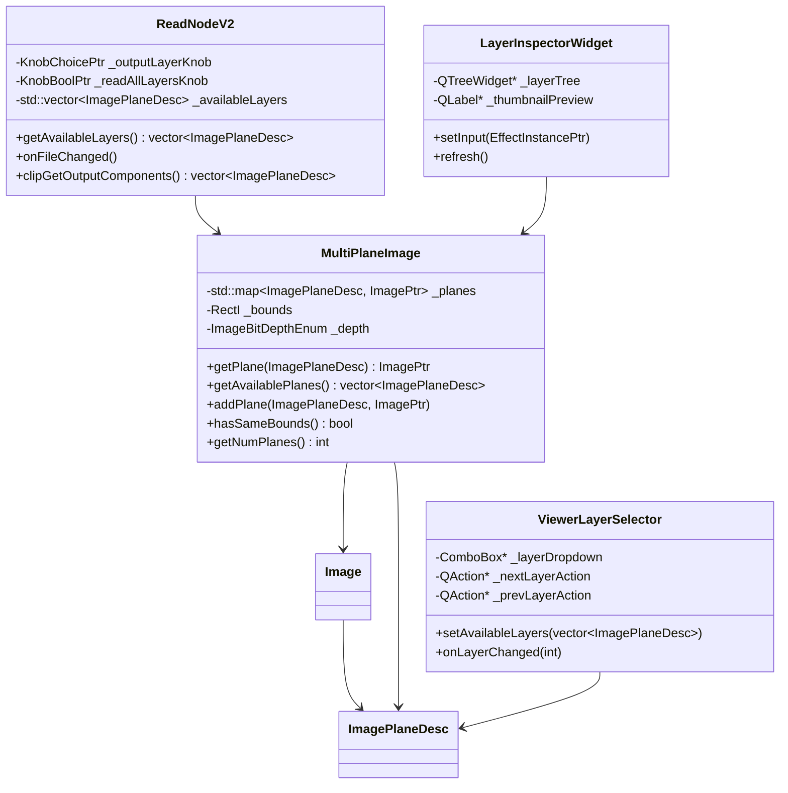
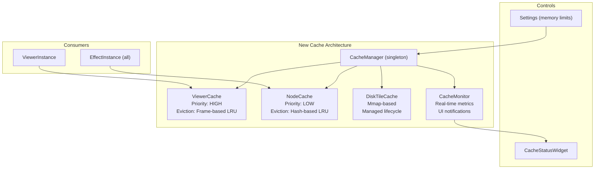
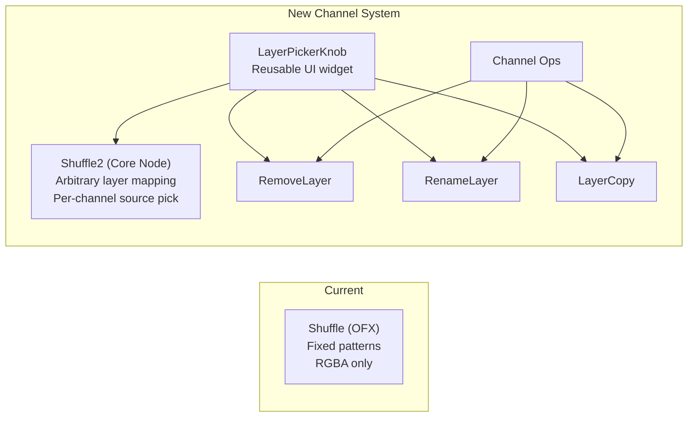
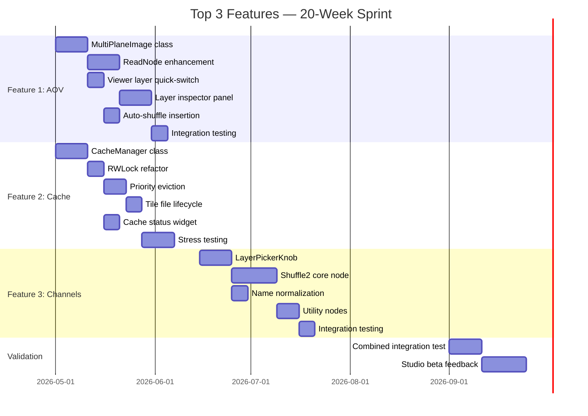

# Natron: Top 3 Feature Implementation Plan

## Selection Criteria

The three features below were selected as the optimal starting point based on this matrix:

| Feature | Impact | Feasibility | Risk | Dependencies | Score |
|---------|--------|------------|------|-------------|-------|
| **Multi-layer EXR / AOV Ergonomics** | ★★★★★ | ★★★★☆ | Medium | None (standalone) | **19/20** |
| **Cache System Hardening** | ★★★★★ | ★★★☆☆ | High | None (foundational) | **17/20** |
| **Channel Management Modernization** | ★★★★★ | ★★★★☆ | Low | Benefits from #1 | **18/20** |

> [!IMPORTANT]
> These three features are synergistic: the AOV workflow (#1) enables CG compositing, channel management (#3) makes it efficient, and the cache refactor (#2) ensures it's stable under load. Together, they unlock the single most important compositor use case: **CG integration**.

---

## Feature 1: Multi-layer EXR / AOV Ergonomics

### Problem Statement

A professional compositor receiving a CG render gets a multi-layer EXR file containing 10-30 AOVs (diffuse, specular, reflection, SSS, depth, motion vectors, cryptomatte, etc.). In Nuke, this is opened with a single Read node and all layers are immediately accessible via dropdown selectors throughout the pipeline.

In Natron today:
1. `ReadNode` reads only one layer at a time (configurable via knob, but single-output)
2. Accessing additional layers requires manual `Shuffle` nodes per layer
3. No visual inspection of available layers in the file
4. The viewer can switch layers via `setActiveLayer()` but the UI for this is a buried combo box

This makes CG compositing — 80%+ of professional VFX work — painfully inefficient.

### Proposed Architecture



### Implementation Steps

#### Step 1.1: MultiPlaneImage Wrapper (Engine)

**New files:**
- `Engine/MultiPlaneImage.h`
- `Engine/MultiPlaneImage.cpp`

```cpp
// Engine/MultiPlaneImage.h
#ifndef ENGINE_MULTIPLANEIMAGE_H
#define ENGINE_MULTIPLANEIMAGE_H

#include "Engine/Image.h"
#include "Engine/ImagePlaneDesc.h"
#include <map>

NATRON_NAMESPACE_ENTER

class MultiPlaneImage {
public:
    MultiPlaneImage();
    ~MultiPlaneImage();
    
    // Add a plane to the collection
    void addPlane(const ImagePlaneDesc& desc, const ImagePtr& image);
    
    // Get a specific plane (returns null if not present)
    ImagePtr getPlane(const ImagePlaneDesc& desc) const;
    
    // Get all available plane descriptors
    std::vector<ImagePlaneDesc> getAvailablePlanes() const;
    
    // Check if a plane exists
    bool hasPlane(const ImagePlaneDesc& desc) const;
    
    // Get the number of planes
    int getNumPlanes() const;
    
    // Get bounds (union of all plane bounds)
    RectI getBounds() const;
    
private:
    mutable QMutex _mutex;
    std::map<ImagePlaneDesc, ImagePtr> _planes;
};

typedef std::shared_ptr<MultiPlaneImage> MultiPlaneImagePtr;

NATRON_NAMESPACE_EXIT
#endif
```

**Rationale:** This wrapper does NOT replace `Image` — it aggregates multiple `Image` objects. This preserves full backward compatibility: all existing code operates on single `Image` objects as before. The wrapper is used only at the IO boundary (ReadNode) and in the Viewer.

#### Step 1.2: ReadNode Enhancement

**Modified file:** `Engine/ReadNode.cpp` (~1340 lines)

Currently, `ReadNode` wraps an OIIO-based OFX reader plugin. The available layers are determined by the file metadata and exposed via an OFX choice parameter.

**Changes:**
1. After file metadata is read, build a `std::vector<ImagePlaneDesc>` of all available layers
2. Add a `KnobBool` "readAllLayers" — when enabled, the node's `getLayersProducedAndNeeded()` reports all layers
3. Modify `clipGetOutputComponents()` to report multi-plane output when readAllLayers is true
4. Emit signal when available layers change (for UI refresh)

**Key integration point in existing code:**

The `EffectInstance::getComponentsNeededAndProduced()` method ([EffectInstance.h](file:///Users/davidepace/progetti/Polito/Tesi/Progetti/Post-Produzione/R&D/Natron-RB-2.6/Engine/EffectInstance.h) line ~450) already supports multi-plane output via the OFX multi-plane extension. The `ImagePlaneDesc` class ([ImagePlaneDesc.h](file:///Users/davidepace/progetti/Polito/Tesi/Progetti/Post-Produzione/R&D/Natron-RB-2.6/Engine/ImagePlaneDesc.h)) already handles plane naming and component mapping. The infrastructure exists — we need to make the UI expose it properly.

#### Step 1.3: Viewer Layer Quick-Switch

**Modified files:**
- `Gui/ViewerTab.cpp` — Add layer dropdown next to the existing channel selector
- `Engine/ViewerInstance.h` line 254: `setActiveLayer()` already exists
- `Gui/ViewerTab20.cpp` — Add keyboard shortcuts (Page Up/Down) for layer cycling

```cpp
// New in ViewerTab.h, alongside existing _viewerChannels ComboBox
ComboBox* _viewerLayerChoice;  // Layer selector dropdown

// Connected to:
void onLayerChoiceChanged(int index);

// Which calls:
// _viewerNode->setActiveLayer(selectedLayer, true /*doRender*/);
```

**Keyboard shortcuts:**
- `Page Up` / `Page Down` — cycle through available layers
- `L` — open layer selector popup (searchable)

#### Step 1.4: Layer Inspector Panel (Gui)

**New files:**
- `Gui/LayerInspectorWidget.h`
- `Gui/LayerInspectorWidget.cpp`

A dockable panel showing:
- Tree view: Layer Name → Channel Names
- Thumbnail preview (64x64) for each layer
- Pixel values under cursor for selected layers
- "Connect to Shuffle" button for quick hookup

Registered as a new panel type in `PanelWidget.cpp`.

#### Step 1.5: Auto-Shuffle Insertion

**Modified file:** `Gui/NodeGraph30.cpp` — `autoConnectNodes()`

When connecting a multi-plane output to a single-plane input:
1. Detect mismatch: source has multiple planes, target expects one
2. Prompt: "Which layer should be connected?" with dropdown
3. Auto-insert `Shuffle` node configured for the selected layer

### Testing Strategy

| Test | Type | Description |
|------|------|-------------|
| `TestMultiPlaneImage` | Unit | Create, add planes, query planes, bounds checking |
| `TestReadNodeMultiLayer` | Integration | Open 20-layer EXR; verify all layers are reported |
| `TestViewerLayerSwitch` | Render regression | Switch layers in viewer; compare output against golden images |
| `TestAutoShuffle` | Integration | Connect multi-plane to single-plane; verify Shuffle is auto-inserted |
| `TestLayerNameRoundTrip` | E2E | Read → Process → Write; verify layer names preserved |

### Backward Compatibility

- `MultiPlaneImage` is additive; no existing API is changed
- `ReadNode` default behavior (single-layer output) is preserved; multi-layer is opt-in
- Viewer layer selector is a new UI element; existing channel selector is untouched
- Old project files work identically (no serialization change)

### Estimated Effort: 6-8 weeks

---

## Feature 2: Cache System Hardening

### Problem Statement

The current `Cache<T>` template class ([Cache.h](file:///Users/davidepace/progetti/Polito/Tesi/Progetti/Post-Produzione/R&D/Natron-RB-2.6/Engine/Cache.h), 1915 lines) is the foundation of Natron's performance. It is also the source of the most critical stability issues:

1. **Lock contention:** Three separate mutexes (`_lock`, `_getLock`, `_sizeLock`, lines 489-491) create deadlock potential and serialization bottlenecks
2. **No priority eviction:** Viewer frames (high-value, frequently re-accessed) are evicted at the same rate as intermediate node renders (low-value, rarely re-accessed)
3. **Tile cache file leaks:** `allocTile()` / `freeTile()` (lines 678-784) can leak tile files on abnormal termination
4. **Memory accounting inaccuracy:** `_memoryCacheSize` is updated via atomic-like patterns but race conditions exist between size check and allocation (line 795-800)
5. **Deleter thread stalls:** `DeleterThread<T>` (lines 80-194) can stall if destruction of a large image holds a lock that the main thread is waiting on

### Proposed Architecture



### Implementation Steps

#### Step 2.1: Introduce CacheManager

**New files:**
- `Engine/CacheManager.h`
- `Engine/CacheManager.cpp`

```cpp
// Engine/CacheManager.h
class CacheManager : public QObject {
    Q_OBJECT
public:
    static CacheManager& instance();
    
    // Separate cache instances
    Cache<FrameEntry>& viewerCache();       // For viewer texture frames
    Cache<Image>& nodeCache();              // For intermediate node renders
    
    // Global operations
    void setMemoryLimits(size_t viewerMaxRAM, size_t nodeMaxRAM);
    void clearAll();
    void evictLowPriority(size_t bytesNeeded);
    
    // Monitoring
    struct CacheStats {
        size_t viewerRAMUsed, viewerRAMMax;
        size_t nodeRAMUsed, nodeRAMMax;
        size_t diskUsed, diskMax;
        double hitRate;
        int evictionCount;
    };
    CacheStats getStats() const;
    
Q_SIGNALS:
    void statsUpdated(const CacheStats& stats);
    void memoryPressure(double usagePercent);
};
```

**Migration strategy:** The existing `appPTR->getNodeCache()` and `appPTR->getViewerCache()` calls in `AppManager.h` are re-routed to `CacheManager::instance()`:

```cpp
// In AppManager.h — backward-compatible accessor
Cache<Image>& getNodeCache() { return CacheManager::instance().nodeCache(); }
```

#### Step 2.2: Replace Triple-Mutex with RWLock + Atomics

**Modified file:** `Engine/Cache.h` lines 480-527

**Before:**
```cpp
mutable QMutex _sizeLock;   // protects _memoryCacheSize & _diskCacheSize
mutable QMutex _lock;        // protects _memoryCache & _diskCache
mutable QMutex _getLock;     // prevents concurrent get/create
```

**After:**
```cpp
mutable QReadWriteLock _cacheLock;      // Single RW lock for _memoryCache & _diskCache
mutable std::atomic<size_t> _memoryCacheSize{0};  // Lock-free size tracking
mutable std::atomic<size_t> _diskCacheSize{0};     // Lock-free size tracking
// _getLock removed — concurrent gets are safe with RW lock
```

The `get()` method (line 615-625) currently takes both `_getLock` and `_lock`. With a RWLock:
- `get()` takes read lock only → multiple concurrent reads
- `createInternal()` takes write lock → exclusive during insertion

#### Step 2.3: Priority-Based Eviction

**Modified:** `Cache.h` eviction logic (within `createInternal()` and memory-pressure callbacks)

Add priority tier to each cache entry:
```cpp
enum CachePriority {
    eCachePriorityLow = 0,     // Intermediate renders
    eCachePriorityMedium = 1,  // Recent node renders
    eCachePriorityHigh = 2     // Viewer frames in playback range
};
```

Eviction order: Low → Medium → High. Within each tier, standard LRU.

The `LRUHashTable.h` is modified to support priority-aware eviction:
```cpp
template<typename Key, typename Value>
class PriorityLRUHashTable {
    // Three LRU lists, one per priority tier
    LRUList _tiers[3];
    
    void evict(size_t bytesNeeded) {
        for (int priority = 0; priority <= 2; ++priority) {
            while (bytesNeeded > 0 && !_tiers[priority].empty()) {
                auto evicted = _tiers[priority].evictLRU();
                bytesNeeded -= evicted->size();
            }
            if (bytesNeeded <= 0) break;
        }
    }
};
```

#### Step 2.4: Tile Cache Lifecycle Management

**Modified:** `Cache.h` lines 678-784 (`allocTile`, `freeTile`)

**Changes:**
1. Add startup scan: on app launch, enumerate tile cache files, detect orphans (files not referenced by any project's TOC), offer cleanup
2. Add `TileCacheFile` reference counting: track active references; file is eligible for deletion only when `use_count == 0`
3. Add periodic cleanup of freed tiles within files (compact step)
4. Cap total tile cache files at configured limit (default: 10, each ~2GB)

#### Step 2.5: Cache Status Widget (Gui)

**New files:**
- `Gui/CacheStatusWidget.h`
- `Gui/CacheStatusWidget.cpp`

A status bar widget showing:
- RAM gauge (green/yellow/red)
- Disk gauge
- Hit/miss ratio as percentage
- "Clear Cache" button
- Tooltip with detailed breakdown

Connected to `CacheManager::statsUpdated()` signal, updated every 500ms.

### Testing Strategy

| Test | Type | Description |
|------|------|-------------|
| `TestCacheManagerSeparation` | Unit | Verify viewer and node caches are independent; evicting from one doesn't affect other |
| `TestConcurrentCacheAccess` | Stress | 16 threads doing get/create simultaneously; no deadlock, no corruption |
| `TestPriorityEviction` | Unit | Fill cache; verify low-priority evicted before high-priority |
| `TestTileFileCleanup` | Integration | Abnormal termination simulation; restart; verify orphan detection |
| `TestMemoryLimits` | Stress | Generate 10GB of renders; verify memory stays within configured limit |
| `TestCacheStatusWidget` | GUI | Verify widget updates reflect actual cache state |

### Backward Compatibility

- `Cache<T>` external API (`get()`, entry creation) is unchanged
- `AppManager::getNodeCache()` / `getViewerCache()` still work (delegated to CacheManager)
- Project files don't reference cache — no serialization concern
- Tile cache files from old versions are detected and migrated or cleaned

### Risk Mitigation

> [!CAUTION]
> This is the highest-risk change. A cache bug can manifest as: crashes, wrong images, memory exhaustion, or data corruption. Every change must be behind a feature flag.

```cpp
// In Settings.h — new setting
KnobBoolPtr _useNewCacheManager;  // Default: false during Phase 1 testing
```

The old cache path remains available as fallback during the entire Phase 1 testing period.

### Estimated Effort: 8-10 weeks

---

## Feature 3: Channel Management Modernization

### Problem Statement

Channel management in compositing is like variable management in programming — you do it on every single line. In Natron:

1. The **Shuffle node** (OFX plugin, not core) is primitive: limited to predefined channel patterns, no arbitrary layer mapping
2. **Channel naming** is inconsistent: some nodes use OFX conventions (`OfxImagePlaneColour`), others use EXR conventions (`diffuse.R`), and the mapping in [ImagePlaneDesc.cpp](file:///Users/davidepace/progetti/Polito/Tesi/Progetti/Post-Produzione/R&D/Natron-RB-2.6/Engine/ImagePlaneDesc.cpp) handles this but with gaps
3. **No utility nodes** for common operations: remove layer, rename layer, reorder channels, split/combine
4. The existing `ImagePlaneDesc` class (line 68-269 of [ImagePlaneDesc.h](file:///Users/davidepace/progetti/Polito/Tesi/Progetti/Post-Produzione/R&D/Natron-RB-2.6/Engine/ImagePlaneDesc.h)) is well-designed internally but the UI never exposes its full power

### Proposed Architecture



### Implementation Steps

#### Step 3.1: LayerPickerKnob — Reusable Layer Selector

**New files:**
- `Engine/KnobLayerPicker.h` / `.cpp`
- `Gui/KnobGuiLayerPicker.h` / `.cpp`

A new Knob type that:
1. Queries connected input for available `ImagePlaneDesc` objects
2. Displays a searchable dropdown showing all layers with channel names
3. Supports per-channel selection (e.g., "diffuse.R → output.R, specular.G → output.G")
4. Emits `valueChanged` when selection changes

```cpp
// Engine/KnobLayerPicker.h
class KnobLayerPicker : public KnobI {
public:
    // Selected layer descriptor
    ImagePlaneDesc getSelectedLayer() const;
    void setSelectedLayer(const ImagePlaneDesc& desc);
    
    // Per-channel mapping (for Shuffle2)
    struct ChannelMapping {
        ImagePlaneDesc sourceLayer;
        int sourceChannelIndex;
        int targetChannelIndex;
    };
    std::vector<ChannelMapping> getChannelMappings() const;
    
    // Refresh available layers from connected input
    void refreshAvailableLayers();
};
```

The GUI counterpart shows a tree-style picker with layer groups expandable to individual channels.

#### Step 3.2: Shuffle2 — New Core Channel Mapping Node

**New files:**
- `Engine/Shuffle2.h` / `.cpp`

This is a **core Natron node** (not OFX), because:
1. It needs direct access to `MultiPlaneImage` and `ImagePlaneDesc`
2. OFX lacks good primitives for arbitrary multi-plane channel routing
3. It needs tight UI integration (drag-and-drop channel matrix)

**Interface:**

```
Inputs: A (main), B (secondary)
Outputs: 1 (routed)

Knobs:
  - outputLayer: LayerPickerKnob (what layer to produce)
  - channelR: source selector (A.diffuse.R / B.specular.G / constant 0/1)
  - channelG: source selector  
  - channelB: source selector
  - channelA: source selector
```

**The GUI** presents this as a matrix:

```
┌─────────────┬──────────────┐
│  Output.R   │ A > diffuse.R│ ◄ dropdown
│  Output.G   │ A > diffuse.G│
│  Output.B   │ A > diffuse.B│
│  Output.A   │ B > matte.A  │
└─────────────┴──────────────┘
```

**Rendering:** In `render()`, for each output pixel:
```cpp
for (int y = roi.y1; y < roi.y2; ++y) {
    for (int x = roi.x1; x < roi.x2; ++x) {
        for (int c = 0; c < 4; ++c) {
            ChannelMapping& m = _mappings[c];
            if (m.isConstant) {
                outPixel[c] = m.constantValue;
            } else {
                Image* srcImg = (m.fromB) ? inputB : inputA;
                outPixel[c] = srcImg->getPixel(x, y, m.sourceChannelIndex);
            }
        }
    }
}
```

**Integration with existing OFX Shuffle:** The old Shuffle remains available for backward compatibility. Shuffle2 is the recommended replacement, exposed prominently in the node menu.

#### Step 3.3: Channel Naming Convention Enforcement

**Modified file:** `Engine/ImagePlaneDesc.cpp`

Add a normalization layer:
```cpp
// Normalize channel names to EXR convention
static std::string normalizeLayerName(const std::string& rawName) {
    // "OfxImagePlaneColour" → "rgba"
    // "OfxImagePlaneBackwardMotionVector" → "motion.backward"
    // "diffuseColor" → "diffuse" (Renderman convention)
    // "Diffuse_Color" → "diffuse" (Arnold convention)
    // Pass through already-standard names
    static std::map<std::string, std::string> _nameMap = {
        {"OfxImagePlaneColour", "rgba"},
        {"OfxImagePlaneBackwardMotionVector", "motion.backward"},
        {"OfxImagePlaneForwardMotionVector", "motion.forward"},
        {"OfxImagePlaneStereoDisparityLeft", "disparity.left"},
        {"OfxImagePlaneStereoDisparityRight", "disparity.right"},
        // ... etc
    };
    auto it = _nameMap.find(rawName);
    return (it != _nameMap.end()) ? it->second : rawName;
}
```

This is applied at the OFX → Natron boundary in `OfxClipInstance.cpp` when planes are reported, ensuring consistent naming throughout the pipeline.

#### Step 3.4: Utility Nodes for Layer Operations

**New core nodes:**

| Node | Function | Core Logic |
|------|----------|------------|
| `RemoveLayer` | Drop specified layer(s) from multi-plane image | Passthrough minus specified planes |
| `RenameLayer` | Rename a layer without changing data | Remap `ImagePlaneDesc` identifiers |
| `LayerCopy` | Copy one layer and output it as a different layer name | Copy + rename in one node |
| `LayerContactSheet` | Show all layers tiled in one output image | Layout computation + blit |

All registered as core Natron nodes in `AppManager::loadBuiltinNodePlugins()`.

### Testing Strategy

| Test | Type | Description |
|------|------|-------------|
| `TestShuffle2BasicRouting` | Unit | Route A.diffuse → Output.RGBA; verify pixel values |
| `TestShuffle2CrossInput` | Unit | Route A.diffuse.RGB + B.matte.A → Output.RGBA |
| `TestShuffle2Constants` | Unit | Route constant 0 to G, B; constant 1 to A |
| `TestChannelNameNormalization` | Unit | OFX names → EXR names; round-trip |
| `TestRemoveLayer` | Integration | Remove diffuse from 5-layer EXR; verify 4 layers in output |
| `TestRenameLayer` | Integration | Rename "Diffuse_Color" to "diffuse"; verify downstream nodes see new name |
| `TestShuffle2BackwardCompat` | Regression | Old Shuffle nodes in existing projects still work |

### Backward Compatibility

- Old `Shuffle` OFX plugin remains untouched and functional
- Channel naming normalization is applied at the IO boundary, not retroactively to existing projects
- New nodes are additive; no existing node behavior changes
- Project files with old Shuffle nodes load and render identically

### Estimated Effort: 5-6 weeks

---

## Combined Implementation Timeline



## Verification Plan

### Automated Testing
1. **Unit tests** — Each new class gets its own test file (`TestMultiPlaneImage`, `TestCacheManager`, `TestShuffle2`)
2. **Render regression** — Golden EXR comparisons for all new node types
3. **Stress tests** — 500-node scripts with heavy AOV usage; 8-hour soak tests for cache stability
4. **CI pipeline** — All tests run on every commit

### Manual Verification
1. **Workflow test** — Professional compositor performs standard CG integration task; compared time vs. Nuke
2. **Memory monitoring** — Track RSS/VSS over 8-hour session; no unbounded growth
3. **Crash testing** — Abort renders mid-stream; kill process during write; verify recovery
4. **Backward compat** — Load 100 existing .ntp project files; verify identical rendering

### Success Metrics

| Metric | Target | How Measured |
|--------|--------|-------------|
| AOV access time | <2 clicks to view any layer | UX timer test |
| CG comp setup time | 50% reduction vs. current Natron | Timed task comparison |
| Cache-related crashes | Zero in 8-hour soak test | Automated monitoring |
| Memory limit adherence | Within ±5% of configured limit | RSS monitoring |
| Render determinism | Bit-exact across 100 consecutive renders | OIIO-diff comparison |
| Old project compatibility | 100% of test projects load/render correctly | Automated regression |
